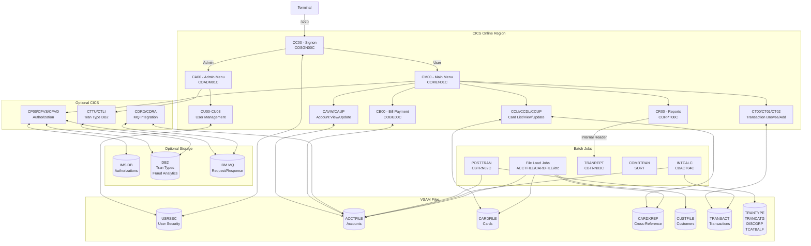
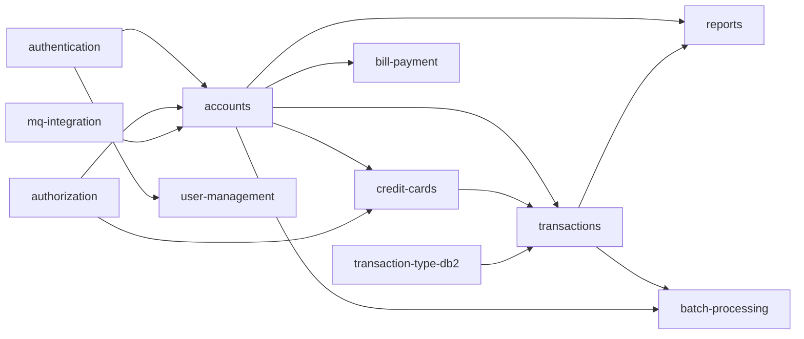

# System CardDemo - Overview for User Stories

**Version:** 2025-03-06  
**Purpose:** Single source of truth for creating well-structured User Stories

---

## 📊 Platform Statistics

- **Technology Stack:** COBOL, CICS, VSAM, JCL, RACF, Assembler (+ optional DB2, IMS DB, MQ)
- **Architecture Pattern:** Mainframe CICS online + batch processing, VSAM file-based storage
- **Key Capabilities:** Credit card management, account management, transaction processing, bill payment, reporting, user administration
- **Supported Users:** Regular users (card/account management), Admin users (user & type management)
- **CICS Transactions:** 20+ online transactions (CC00, CM00, CAVW, CAUP, CCLI, CCDL, CCUP, CT00–CT02, CR00, CB00, CU00–CU03, CA00, CTTU, CTLI, CDRD, CDRA, CPVS, CPVD, CP00)
- **Batch Jobs:** 20+ JCL jobs for data loading, transaction posting, interest calculation, reporting

---

## 🏗️ High-Level Architecture

### Technology Stack

**Primary Language:** COBOL (IBM Enterprise COBOL)  
**Transaction Processor:** CICS (Customer Information Control System)  
**Storage:** VSAM (KSDS with AIX - Alternate Indexes)  
**Batch Scheduler:** JCL (Job Control Language)  
**Security:** RACF (Resource Access Control Facility)  
**System Programming:** IBM Assembler (MVSWAIT, COBDATFT utilities)  
**Optional – Relational DB:** DB2 (Transaction Type Management, Authorization analytics)  
**Optional – Hierarchical DB:** IMS DB (Authorization storage)  
**Optional – Messaging:** IBM MQ (Authorization processing, Account extraction)

### Architectural Patterns

- **CICS Pseudo-Conversational:** Each screen send/receive is a separate transaction; state passed via COMMAREA
- **VSAM KSDS with AIX:** Primary key access plus alternate indexes for flexible querying
- **Batch/Online Integration:** Batch jobs process daily transactions; CICS provides online access to VSAM
- **Copybook-Driven Data Structures:** Shared record layouts via COBOL copybooks (CVCUS01Y, CVACT01Y, CVTRA05Y, etc.)
- **BMS Maps:** CICS Basic Mapping Support screens for terminal interaction
- **Two-tier processing:** Online CICS for interactive use; batch JCL for bulk/scheduled operations

---

## 📚 Module Catalog

<!-- MODULE_LIST_START -->
**Modules:** authentication, accounts, credit-cards, transactions, bill-payment, reports, user-management, batch-processing, authorization, transaction-type-db2, mq-integration
<!-- MODULE_LIST_END -->

---

### 1. Authentication
**ID:** `authentication`  
**Purpose:** Signon and session management for all CardDemo users (regular and admin)  
**Key Components:**
- `COSGN00C` (CICS program) – Signon screen logic, RACF/VSAM credential validation
- `COSGN00` (BMS map) – Signon screen definition
- `CSUSR01Y` (copybook) – User security record layout (SEC-USER-DATA)
- VSAM file: `USRSEC` – User credentials and type (`U` regular / `A` admin)

**CICS Transactions:**
- `CC00` → `COSGN00C` – Initial signon screen (entry point for all users)

**Data Model – SEC-USER-DATA (CSUSR01Y, 80 bytes):**
```
SEC-USR-ID       PIC X(08)   - Login user ID
SEC-USR-FNAME    PIC X(20)   - First name
SEC-USR-LNAME    PIC X(20)   - Last name
SEC-USR-PWD      PIC X(08)   - Password
SEC-USR-TYPE     PIC X(01)   - U=Regular, A=Admin
SEC-USR-FILLER   PIC X(23)
```

**Business Rules:**
- User ID: up to 8 characters; Password: up to 8 characters
- Default admin: ADMIN001/PASSWORD; Default user: USER0001/PASSWORD
- After successful login, user type determines routing: Admin → Admin Menu (CA00), Regular → Main Menu (CM00)
- Invalid credentials display error on signon screen; no automatic lockout in base implementation

**User Story Examples:**
- As a cardholder, I want to sign into the system so I can manage my account
- As an admin, I want to sign in with elevated privileges so I can administer users
- As a security officer, I want failed login attempts to be tracked so I can detect intrusions

---

### 2. Accounts
**ID:** `accounts`  
**Purpose:** View and update credit card account information including balances, limits, and dates  
**Key Components:**
- `COACTVWC` (CICS, CAVW) – Account view screen
- `COACTUPC` (CICS, CAUP) – Account update screen
- `CBACT01C` (Batch) – Read/print account data
- `CBACT02C` (Batch) – Account data utility
- `CBACT03C` (Batch) – Account data utility
- `CBACT04C` (Batch, INTCALC) – Interest calculator
- `COACTVW` / `COACTUP` (BMS maps) – Account screens
- `CVACT01Y` (copybook) – Account record layout
- VSAM file: `ACCTFILE` (KSDS, 300 bytes per record)

**CICS Transactions:**
- `CAVW` → `COACTVWC` – View account details
- `CAUP` → `COACTUPC` – Update account information

**Data Model – ACCOUNT-RECORD (CVACT01Y, 300 bytes):**
```
ACCT-ID                  PIC 9(11)        - Account identifier
ACCT-ACTIVE-STATUS       PIC X(01)        - Active/Inactive flag
ACCT-CURR-BAL            PIC S9(10)V99    - Current balance
ACCT-CREDIT-LIMIT        PIC S9(10)V99    - Credit limit
ACCT-CASH-CREDIT-LIMIT   PIC S9(10)V99    - Cash credit limit
ACCT-OPEN-DATE           PIC X(10)        - Date opened (YYYY-MM-DD)
ACCT-EXPIRAION-DATE      PIC X(10)        - Account expiration date
ACCT-REISSUE-DATE        PIC X(10)        - Last reissue date
ACCT-CURR-CYC-CREDIT     PIC S9(10)V99    - Current cycle credits
ACCT-CURR-CYC-DEBIT      PIC S9(10)V99    - Current cycle debits
ACCT-ADDR-ZIP            PIC X(10)        - ZIP code for billing
ACCT-GROUP-ID            PIC X(10)        - Disclosure group ID
FILLER                   PIC X(178)
```

**Business Rules:**
- Account balance cannot exceed credit limit
- Interest is calculated batch via INTCALC (CBACT04C) using TCATBALF disclosure group rates
- Cash advances subject to separate ACCT-CASH-CREDIT-LIMIT
- ACCT-GROUP-ID links to disclosure group (DISCGRP file) to determine interest rates by transaction type/category

**User Story Examples:**
- As a cardholder, I want to view my current balance and credit limit so I know my available credit
- As a cardholder, I want to update my account ZIP code so my billing address is current
- As an operations analyst, I want to run interest calculations so month-end balances are updated

---

### 3. Credit Cards
**ID:** `credit-cards`  
**Purpose:** List, view, and update credit card details associated with an account  
**Key Components:**
- `COCRDLIC` (CICS, CCLI) – Credit card list
- `COCRDSLC` (CICS, CCDL) – Credit card view/select
- `COCRDUPC` (CICS, CCUP) – Credit card update
- `COCRDLI` / `COCRDSL` / `COCRDUP` (BMS maps) – Card screens
- `CVACT02Y` (copybook) – Card record layout
- `CVACT03Y` (copybook) – Card/Account/Customer cross-reference layout
- VSAM files: `CARDFILE` (KSDS, 150 bytes), `CARDXREF` (KSDS, 50 bytes)

**CICS Transactions:**
- `CCLI` → `COCRDLIC` – List credit cards for an account
- `CCDL` → `COCRDSLC` – View details of a specific card
- `CCUP` → `COCRDUPC` – Update card information

**Data Model – CARD-RECORD (CVACT02Y, 150 bytes):**
```
CARD-NUM              PIC X(16)     - 16-digit card number
CARD-ACCT-ID          PIC 9(11)     - Linked account ID
CARD-CVV-CD           PIC 9(03)     - CVV security code
CARD-EMBOSSED-NAME    PIC X(50)     - Name on card
CARD-EXPIRAION-DATE   PIC X(10)     - Expiration date (YYYY-MM-DD)
CARD-ACTIVE-STATUS    PIC X(01)     - Active/Inactive flag
FILLER                PIC X(59)
```

**Data Model – CARD-XREF-RECORD (CVACT03Y, 50 bytes):**
```
XREF-CARD-NUM   PIC X(16)   - Card number (key)
XREF-CUST-ID    PIC 9(09)   - Customer ID
XREF-ACCT-ID    PIC 9(11)   - Account ID
FILLER          PIC X(14)
```

**Business Rules:**
- Each card is linked to one account via CARD-ACCT-ID
- CARDXREF provides cross-reference between card number, customer, and account
- Card status (active/inactive) controlled via CARD-ACTIVE-STATUS field
- CVV stored but not displayed in update screens for security

**User Story Examples:**
- As a cardholder, I want to list all my credit cards so I know which cards are active
- As a cardholder, I want to view card details so I can verify expiration dates
- As an admin, I want to update card status to active/inactive so I can manage card lifecycle
- As a fraud analyst, I want to look up a card by number to find the linked account

---

### 4. Transactions
**ID:** `transactions`  
**Purpose:** View, add, and process credit card transactions (online and batch)  
**Key Components:**
- `COTRN00C` (CICS, CT00) – Transaction list
- `COTRN01C` (CICS, CT01) – Transaction view
- `COTRN02C` (CICS, CT02) – Transaction add
- `CBTRN01C` (Batch) – Transaction data utility/read
- `CBTRN02C` (Batch, POSTTRAN) – Daily transaction posting
- `CBTRN03C` (Batch, TRANREPT) – Transaction detail report
- `COTRN00` / `COTRN01` / `COTRN02` (BMS maps) – Transaction screens
- `CVTRA05Y` (copybook) – Transaction record layout (VSAM KSDS)
- `CVTRA06Y` (copybook) – Daily transaction file layout (sequential)
- `CVTRA03Y` (copybook) – Transaction type record
- `CVTRA04Y` (copybook) – Transaction category record
- VSAM files: `TRANSACT` (KSDS, 350 bytes), `TRANTYPE`, `TRANCATG`
- Sequential file: `DALYTRAN` (daily transactions for batch posting)

**CICS Transactions:**
- `CT00` → `COTRN00C` – Browse/list transactions by card or account
- `CT01` → `COTRN01C` – View a specific transaction detail
- `CT02` → `COTRN02C` – Add a new transaction

**Data Model – TRAN-RECORD (CVTRA05Y, 350 bytes):**
```
TRAN-ID             PIC X(16)       - Transaction identifier (unique)
TRAN-TYPE-CD        PIC X(02)       - Transaction type code
TRAN-CAT-CD         PIC 9(04)       - Category code
TRAN-SOURCE         PIC X(10)       - Source system
TRAN-DESC           PIC X(100)      - Description
TRAN-AMT            PIC S9(09)V99   - Transaction amount (signed)
TRAN-MERCHANT-ID    PIC 9(09)       - Merchant identifier
TRAN-MERCHANT-NAME  PIC X(50)       - Merchant name
TRAN-MERCHANT-CITY  PIC X(50)       - Merchant city
TRAN-MERCHANT-ZIP   PIC X(10)       - Merchant ZIP
TRAN-CARD-NUM       PIC X(16)       - Card used for transaction
TRAN-ORIG-TS        PIC X(26)       - Original timestamp
TRAN-PROC-TS        PIC X(26)       - Processing timestamp
FILLER              PIC X(20)
```

**Data Model – TRAN-TYPE-RECORD (CVTRA03Y, 60 bytes):**
```
TRAN-TYPE       PIC X(02)   - Type code (e.g., "01"=Purchase)
TRAN-TYPE-DESC  PIC X(50)   - Description
FILLER          PIC X(08)
```

**Data Model – TRAN-CAT-RECORD (CVTRA04Y, 60 bytes):**
```
TRAN-TYPE-CD          PIC X(02)   - Parent type code
TRAN-CAT-CD           PIC 9(04)   - Category code
TRAN-CAT-TYPE-DESC    PIC X(50)   - Category description
FILLER                PIC X(04)
```

**Business Rules:**
- POSTTRAN (CBTRN02C) reads DALYTRAN and posts each transaction to the TRANSACT VSAM file and updates account balances
- Transaction amount updates ACCT-CURR-BAL, ACCT-CURR-CYC-DEBIT / CREDIT
- Transaction category balance (TCATBALF) updated per account/type/category for interest calculation
- COMBTRAN job merges daily and system transactions before report generation
- Transaction types and categories are maintained in TRANTYPE and TRANCATG VSAM files (or DB2 with optional module)

**User Story Examples:**
- As a cardholder, I want to list recent transactions so I can review my spending
- As a cardholder, I want to view transaction details (merchant, amount, date) so I can identify charges
- As a teller, I want to add a transaction so I can record a payment or adjustment
- As a batch operator, I want to run POSTTRAN so daily transactions are applied to accounts

---

### 5. Bill Payment
**ID:** `bill-payment`  
**Purpose:** Process bill payments against credit card accounts  
**Key Components:**
- `COBIL00C` (CICS, CB00) – Bill payment processing screen
- `COBIL00` (BMS map) – Bill payment screen definition
- Accesses ACCTFILE, CARDFILE, TRANSACT VSAM files

**CICS Transactions:**
- `CB00` → `COBIL00C` – Submit a bill payment

**Business Rules:**
- Payment reduces ACCT-CURR-BAL
- Payment recorded as a transaction in TRANSACT VSAM with negative amount (credit)
- Must validate account is active before accepting payment
- Payment amount must be positive and within valid range

**User Story Examples:**
- As a cardholder, I want to make a bill payment so I can reduce my outstanding balance
- As a customer service agent, I want to process a payment on behalf of a customer so their account is credited
- As a system, I want to record each payment as a transaction so the history is complete

---

### 6. Reports
**ID:** `reports`  
**Purpose:** Generate and display transaction reports (online trigger + batch execution)  
**Key Components:**
- `CORPT00C` (CICS, CR00) – Report request screen (submits batch job)
- `CORPT00` (BMS map) – Report screen
- `CBTRN03C` (Batch, TRANREPT) – Transaction detail report printer
- `CSUTLDTC` (CICS utility) – Date/time formatting utility
- Procedure: `TRANREPT.prc` – JCL procedure for report execution

**CICS Transactions:**
- `CR00` → `CORPT00C` – Request transaction report (with date range)

**Batch Jobs:**
- `TRANREPT` → `CBTRN03C` – Print/generate transaction detail report (submitted from CICS or standalone)
- `CREASTMT` → `CBSTM03A` – Produce customer statement

**Business Rules:**
- Reports are submitted as background batch jobs from CICS (Internal Reader)
- Report parameters include date range for filtering transactions
- Report output written to SYSOUT or GDG dataset

**User Story Examples:**
- As a cardholder, I want to generate a transaction report for a date range so I can reconcile my account
- As an operations analyst, I want to produce monthly statements so customers receive billing summaries
- As a compliance officer, I want a full transaction history so I can audit account activity

---

### 7. User Management
**ID:** `user-management`  
**Purpose:** Administrative management of CardDemo user accounts (list, add, update, delete)  
**Key Components:**
- `COADM01C` (CICS, CA00) – Admin menu
- `COUSR00C` (CICS, CU00) – List users
- `COUSR01C` (CICS, CU01) – Add user
- `COUSR02C` (CICS, CU02) – Update user
- `COUSR03C` (CICS, CU03) – Delete user
- `COADM01` / `COUSR00`–`COUSR03` (BMS maps) – Admin/user screens
- `CSUSR01Y` (copybook) – User security record
- VSAM file: `USRSEC` (KSDS, 80 bytes)
- JCL: `DUSRSECJ` – Initial user security file load

**CICS Transactions:**
- `CA00` → `COADM01C` – Admin menu (available to admin users only)
- `CU00` → `COUSR00C` – List all users
- `CU01` → `COUSR01C` – Add new user
- `CU02` → `COUSR02C` – Update existing user
- `CU03` → `COUSR03C` – Delete user

**Business Rules:**
- Only admin users (SEC-USR-TYPE = 'A') can access admin menu and user management
- User ID must be unique in USRSEC file
- User type must be 'U' (regular) or 'A' (admin)
- Deleting a user does not cascade-delete associated transactions or accounts
- Initial user file loaded via DUSRSECJ batch job using IEBGENER

**User Story Examples:**
- As an admin, I want to list all users so I can see who has system access
- As an admin, I want to add a new user so a new employee can access the system
- As an admin, I want to update a user's password so they can regain access
- As an admin, I want to delete a user so a terminated employee loses access
- As a security officer, I want to change a user's type so their permissions are correctly set

---

### 8. Batch Processing
**ID:** `batch-processing`  
**Purpose:** Bulk data operations including file loading, transaction posting, interest calculation, and reporting  
**Key Components:**
- `CBACT01C` – Read/print account master
- `CBACT02C` – Account data utility (read card/account)
- `CBACT03C` – Account data utility (cross-reference)
- `CBACT04C` (INTCALC) – Interest calculation
- `CBTRN01C` – Transaction data read utility
- `CBTRN02C` (POSTTRAN) – Daily transaction posting
- `CBTRN03C` (TRANREPT) – Transaction detail report
- `CBCUS01C` – Customer data read/print
- `CBEXPORT` / `CBIMPORT` – Data export/import utilities
- `COBSWAIT` (WAITSTEP) – Job step wait timer
- `MVSWAIT.asm` / `COBDATFT.asm` – Assembler utilities
- JCL Jobs: POSTTRAN, INTCALC, COMBTRAN, TRANREPT, CREASTMT, TRANBKP, various file setup jobs

**Key Batch Job Sequence (Full Batch Run):**
```
1.  CLOSEFIL   - Close CICS VSAM files
2.  ACCTFILE   - Refresh account master (IDCAMS REPRO)
3.  CARDFILE   - Refresh card master (IDCAMS REPRO)
4.  XREFFILE   - Load card/account/customer cross-reference
5.  CUSTFILE   - Load customer master
6.  TRANBKP    - Backup transaction master
7.  TRANCATG   - Load transaction category types
8.  TRANTYPE   - Load transaction types
9.  DISCGRP    - Load disclosure groups (interest rates)
10. TCATBALF   - Load transaction category balances
11. DUSRSECJ   - Load user security file
12. POSTTRAN   - Post daily transactions (CBTRN02C)
13. INTCALC    - Calculate interest (CBACT04C)
14. COMBTRAN   - Merge daily + system transactions
15. CREASTMT   - Generate statements
16. TRANIDX    - Rebuild alternate indexes
17. OPENFIL    - Re-open CICS VSAM files
```

**Data Model – TRAN-CAT-BAL-RECORD (CVTRA01Y, 50 bytes):**
```
TRANCAT-ACCT-ID    PIC 9(11)     - Account ID
TRANCAT-TYPE-CD    PIC X(02)     - Transaction type code
TRANCAT-CD         PIC 9(04)     - Category code
TRAN-CAT-BAL       PIC S9(09)V99 - Category balance
FILLER             PIC X(22)
```

**Data Model – DIS-GROUP-RECORD (CVTRA02Y, 50 bytes):**
```
DIS-ACCT-GROUP-ID  PIC X(10)     - Account group ID
DIS-TRAN-TYPE-CD   PIC X(02)     - Transaction type
DIS-TRAN-CAT-CD    PIC 9(04)     - Transaction category
DIS-INT-RATE       PIC S9(04)V99 - Interest rate
FILLER             PIC X(28)
```

**Business Rules:**
- POSTTRAN must run after CLOSEFIL (to prevent CICS file conflicts)
- INTCALC uses TCATBALF balances and DISCGRP rates to compute monthly interest
- COMBTRAN uses SORT to merge DALYTRAN with system-generated transactions
- TRANBKP creates GDG backup of transaction master before processing
- DEFGDGB/DEFGDGD must be run once to set up GDG bases before backups

**User Story Examples:**
- As a batch operator, I want to run POSTTRAN nightly so transaction files are updated
- As a finance analyst, I want to run INTCALC monthly so interest charges are applied
- As a operations manager, I want a nightly batch job sequence so all data is consistently updated
- As a DBA, I want to reload VSAM files from sample data so the test environment is refreshed

---

### 9. Authorization
**ID:** `authorization`  
**Purpose:** Real-time credit card authorization processing via MQ, with IMS DB storage and DB2 fraud analytics (optional module)  
**Key Components:**
- `COPAUA0C` (CICS, CP00) – Process authorization requests (MQ trigger)
- `COPAUS0C` (CICS, CPVS) – Pending authorization summary
- `COPAUS1C` (CICS, CPVD) – Pending authorization details (update IMS + insert DB2)
- `COPAUS2C` (CICS) – Authorization processing utility
- `CBPAUP0C` (Batch, CBPAUP0J) – Purge expired authorizations
- BMS maps: `COPAU00`, `COPAU01`
- IMS DB: Customer/account data in hierarchical database
- DB2: Fraud analytics tables
- MQ: Authorization request/response queues

**CICS Transactions:**
- `CP00` → `COPAUA0C` – Process incoming MQ authorization requests
- `CPVS` → `COPAUS0C` – View pending authorization summary
- `CPVD` → `COPAUS1C` – View/process authorization details

**Authorization Flow:**
```
1. MQ-compatible client sends authorization request to MQ queue
2. CP00 (COPAUA0C) triggered by MQ message
3. Account/customer validated via VSAM CARDXREF
4. Business rules applied (credit limit, account status, fraud checks)
5. Authorization stored in IMS DB
6. Response returned via reply MQ queue
7. Admin views via CPVS/CPVD screens
8. CBPAUP0J periodically purges expired authorizations
```

**Business Rules:**
- Authorization approved if: account active, balance + amount < credit limit, fraud checks pass
- Fraud detection rules stored in DB2 tables
- IMS DB stores authorization hierarchy: Customer → Account → Authorization
- Expired authorizations purged by batch job CBPAUP0J
- Cloud/external POS sends authorization requests; COPAUA0C processes as MQ-triggered CICS program

**User Story Examples:**
- As a merchant, I want to submit an authorization request so I know if a transaction will be approved
- As a cardholder, I want to view pending authorizations so I can see what charges are pending
- As a fraud analyst, I want authorization details so I can investigate suspicious activity
- As a batch operator, I want to purge expired authorizations so the IMS DB stays manageable

---

### 10. Transaction Type DB2
**ID:** `transaction-type-db2`  
**Purpose:** Manage transaction type reference data in DB2 tables, demonstrating relational DB integration patterns (optional module)  
**Key Components:**
- `COTRTUPC` (CICS, CTTU) – Transaction type add/edit (DB2 insert/update)
- `COTRTLIC` (CICS, CTLI) – Transaction type list/update/delete (DB2 cursor)
- `COBTUPDT` (Batch, MNTTRDB2) – Batch transaction type maintenance
- BMS maps: `COTRTUP`, `COTRTLI`
- DB2 tables: Transaction type and category reference tables
- JCL: `CREADB21` (create DB2 tables), `TRANEXTR` (extract to VSAM), `MNTTRDB2` (batch maintenance)

**CICS Transactions:**
- `CTTU` → `COTRTUPC` – Add or edit a transaction type in DB2
- `CTLI` → `COTRTLIC` – List, update, or delete transaction types from DB2

**DB2 Integration Patterns Demonstrated:**
- Static embedded SQL with host variables
- Forward and backward cursor processing (CTLI)
- Standard CRUD (Create, Read, Update, Delete)
- DB2 precompiler integration in CICS environment
- SQLCA error handling

**Business Rules:**
- Transaction type code is 2-character alphanumeric key
- TRANEXTR job extracts DB2 data to VSAM-compatible files for integration with base application
- COBTUPDT performs batch-level maintenance (bulk updates/deletes)
- Admin menu options 5 and 6 only enabled when this module is installed

**User Story Examples:**
- As an admin, I want to add a new transaction type so new transaction categories are available
- As an admin, I want to list all transaction types so I can review the reference data
- As an admin, I want to delete an obsolete transaction type so the reference data is clean
- As a batch operator, I want to run TRANEXTR so DB2 transaction types are synced to VSAM

---

### 11. MQ Integration
**ID:** `mq-integration`  
**Purpose:** Demonstrate asynchronous MQ request/response patterns for system date inquiry and account detail extraction (optional module)  
**Key Components:**
- `CODATE01` (CICS, CDRD) – System date inquiry via MQ
- `COACCT01` (CICS, CDRA) – Account details inquiry via MQ
- MQ queues for request/response
- VSAM account data (ACCTFILE)

**CICS Transactions:**
- `CDRD` → `CODATE01` – Inquire system date via MQ request/response
- `CDRA` → `COACCT01` – Inquire account details via MQ request/response

**MQ Integration Pattern:**
```
1. Client sends request to MQ request queue
2. CICS program triggered by MQ message
3. Program processes request (reads VSAM/system data)
4. Response written to MQ reply queue
5. Client reads response from reply queue
```

**Business Rules:**
- MQ must be configured and accessible from CICS before installing this module
- CDRD returns current system date in response message
- CDRA returns account details for specified account ID from ACCTFILE VSAM
- Demonstrates asynchronous decoupling between requestor and CICS application

**User Story Examples:**
- As an external system, I want to query the system date via MQ so I can synchronize timestamps
- As an external system, I want to retrieve account details via MQ so I can integrate account data
- As an architect, I want to demonstrate MQ integration so modernization teams can understand asynchronous patterns

---

## 🔄 Architecture Diagrams

### System Architecture



### Module Dependency Diagram



---

## 📊 Data Models Summary

### Core VSAM Files

| File DDname | Copybook | Record Length | Key | Description |
|:-----------|:---------|:-------------|:----|:-----------|
| USRSEC | CSUSR01Y | 80 | SEC-USR-ID (8) | User security credentials |
| ACCTFILE | CVACT01Y | 300 | ACCT-ID (11) | Account master |
| CARDFILE | CVACT02Y | 150 | CARD-NUM (16) | Card master |
| CUSTFILE | CVCUS01Y | 500 | CUST-ID (9) | Customer master |
| CARDXREF | CVACT03Y | 50 | XREF-CARD-NUM (16) | Card/Account/Customer cross-ref |
| TRANSACT | CVTRA05Y | 350 | TRAN-ID (16) | Online transaction KSDS |
| DALYTRAN | CVTRA06Y | 350 | Sequential | Daily transaction input |
| TRANTYPE | CVTRA03Y | 60 | TRAN-TYPE (2) | Transaction types |
| TRANCATG | CVTRA04Y | 60 | TRAN-TYPE+TRAN-CAT | Transaction categories |
| DISCGRP | CVTRA02Y | 50 | GROUP+TYPE+CAT | Disclosure/interest groups |
| TCATBALF | CVTRA01Y | 50 | ACCT+TYPE+CAT | Category balance by account |

### CUSTOMER-RECORD (CVCUS01Y, 500 bytes)
```cobol
05 CUST-ID                  PIC 9(09)    - Customer ID
05 CUST-FIRST-NAME          PIC X(25)    - First name
05 CUST-MIDDLE-NAME         PIC X(25)    - Middle name
05 CUST-LAST-NAME           PIC X(25)    - Last name
05 CUST-ADDR-LINE-1         PIC X(50)    - Address line 1
05 CUST-ADDR-LINE-2         PIC X(50)    - Address line 2
05 CUST-ADDR-LINE-3         PIC X(50)    - Address line 3
05 CUST-ADDR-STATE-CD       PIC X(02)    - State code
05 CUST-ADDR-COUNTRY-CD     PIC X(03)    - Country code
05 CUST-ADDR-ZIP            PIC X(10)    - ZIP code
05 CUST-PHONE-NUM-1         PIC X(15)    - Primary phone
05 CUST-PHONE-NUM-2         PIC X(15)    - Secondary phone
05 CUST-SSN                 PIC 9(09)    - Social Security Number
05 CUST-GOVT-ISSUED-ID      PIC X(20)    - Government ID
05 CUST-DOB-YYYY-MM-DD      PIC X(10)    - Date of birth
05 CUST-EFT-ACCOUNT-ID      PIC X(10)    - EFT account
05 CUST-PRI-CARD-HOLDER-IND PIC X(01)    - Primary card holder flag
05 CUST-FICO-CREDIT-SCORE   PIC 9(03)    - FICO score (0-999)
05 FILLER                   PIC X(168)
```

---

## 📋 Business Rules by Module

### Authentication Rules
- Session state passed via CICS COMMAREA between pseudo-conversational screens
- User type ('U' vs 'A') determines menu routing and available functions
- RACF provides OS-level security; USRSEC provides application-level credential validation

### Account Rules
- Interest rate determined by ACCT-GROUP-ID → DISCGRP → DIS-INT-RATE
- Cash credit limit (ACCT-CASH-CREDIT-LIMIT) is separate and typically lower than general credit limit
- Account status ('A'=Active, 'I'=Inactive) controls availability of transactions

### Transaction Rules
- Transaction type codes link to descriptive data in TRANTYPE VSAM (or DB2 with optional module)
- Negative TRAN-AMT = credit (payment); Positive TRAN-AMT = debit (purchase)
- DALYTRAN sequential file is input to POSTTRAN batch; TRANSACT VSAM holds posted records
- Alternate index on TRANSACT allows lookup by card number

### Interest Calculation Rules
- Monthly cycle: debit/credit accumulators (ACCT-CURR-CYC-DEBIT, ACCT-CURR-CYC-CREDIT) reset after INTCALC
- Interest rate from DISCGRP.DIS-INT-RATE applied to TCATBALF balances per account/type/category
- INTCALC (CBACT04C) reads TCATBALF sequentially, looks up DISCGRP rates, updates ACCTFILE balances

### Authorization Rules (Optional)
- Credit limit check: ACCT-CURR-BAL + AUTH-AMOUNT ≤ ACCT-CREDIT-LIMIT
- Fraud rules applied based on merchant category, amount thresholds, and frequency
- Authorization expires after configurable time; purged by CBPAUP0J

---

## 🎯 Patterns for User Stories

### Templates by Domain

#### Account/Card Management Stories
**Pattern:** As a [cardholder/admin], I want to [view/update] [account/card] [field] so that [business value]
- As a cardholder, I want to view my current balance so I know my available credit
- As a cardholder, I want to update my ZIP code so billing address is accurate
- As an admin, I want to deactivate a card so a reported lost card cannot be used

#### Transaction Stories
**Pattern:** As a [cardholder/teller/batch operator], I want to [add/view/process] a transaction so that [business value]
- As a cardholder, I want to see my last 30 transactions so I can detect unauthorized charges
- As a teller, I want to add a payment transaction so the customer's balance is reduced
- As a batch operator, I want to post daily transactions so the end-of-day balances are correct

#### Administration Stories
**Pattern:** As an admin, I want to [manage users/configure reference data] so that [business value]
- As an admin, I want to add a new user with type 'U' so a new employee can log in
- As an admin, I want to update transaction type descriptions so the UI shows correct labels

### Story Complexity Guidelines
- **Simple (1-2 pts):** Display a VSAM record on a CICS screen (COACTVWC pattern); change a single field on an existing screen
- **Medium (3-5 pts):** Add/update with validation (COACTUPC pattern); new batch report with existing patterns; new CICS transaction with BMS map
- **Complex (5-8 pts):** New batch job with file matching/posting (CBTRN02C pattern); DB2/IMS integration; MQ request-response; cross-file validation with multiple VSAM datasets
- **Epic (8+ pts):** New optional module (authorization, MQ integration); new data model with VSAM KSDS definition, copybook, JCL, and CICS transaction

### Acceptance Criteria Patterns
- **Display:** Screen shows [field] from [VSAM file] when user navigates to [transaction]
- **Update:** After submitting [transaction], [VSAM record] is updated with new [field] value
- **Validation:** System displays error message when [field] fails [validation rule]
- **Batch:** After running [job], [VSAM file] contains expected [record count/values]
- **Security:** Only users with type 'A' can access [transaction]; type 'U' users receive error
- **Performance:** [Transaction] must respond within 3 seconds under normal load

---

## ⚡ Performance Budgets

- **CICS Response Time:** < 3s per transaction screen (P95)
- **Batch POSTTRAN:** Must complete within batch window (< 4 hours for typical volumes)
- **VSAM Read:** < 100ms per keyed read (P95)
- **Interest Calculation:** INTCALC must process all accounts within nightly batch window
- **Report Generation:** TRANREPT must complete within scheduled batch window

---

## 🚨 Readiness Considerations

### Technical Risks
- **VSAM File Contention:** CICS holds VSAM open; batch jobs require CLOSEFIL before access → Mitigate with proper OPEN/CLOSE job sequencing
- **COMMAREA Size Limits:** CICS COMMAREA limited to 32KB; complex data sharing requires careful design → Use CICS temporary storage or TS queues for larger state
- **DB2/IMS Optional Modules:** Require additional infrastructure setup (DB2 database, IMS DB, MQ) → Document prerequisites clearly in US acceptance criteria

### Tech Debt
- **ACCT-EXPIRAION-DATE typo:** Field name misspelled in copybooks CVACT01Y, CVACT02Y → Low risk, rename requires copybook and all referencing programs
- **Hardcoded credentials in README:** Default ADMIN001/PASSWORD for documentation only; production must use RACF
- **FILLER fields:** Large FILLER areas in records leave room for extension without record length change

### Sequencing for User Stories
- **Prerequisites:** Authentication must be working before any functional module
- **Recommended order:** authentication → accounts → credit-cards → transactions → bill-payment → reports → user-management → batch-processing → optional modules
- **Optional modules** require base application fully installed first

---

## 📈 Success Metrics

### Adoption
- **Target:** All cardholders can log in and view account/card details within first sprint
- **Engagement:** Transaction list view accessed daily by active users
- **Retention:** Monthly statement generation drives regular user return

### Business Impact
- **Account Accuracy:** 100% of posted transactions reflect correct account balance within batch window
- **Authorization Rate:** Authorization processing responds within SLA for all approved requests
- **Batch Reliability:** Nightly batch sequence completes successfully ≥ 99.5% of runs

---

*Last updated: 2025-03-06*  
*Source: CardDemo v1.0 — AWS Mainframe Modernization Reference Application*
