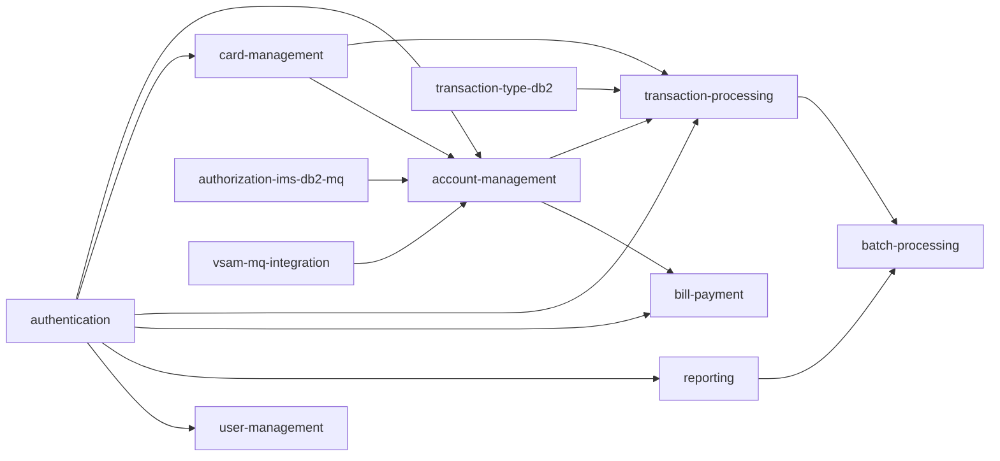

# System CardDemo - Overview for User Stories

**Version:** 2025-03-06  
**Purpose:** Single source of truth for creating well-structured User Stories

---

## 📊 Platform Statistics

- **Technology Stack:** COBOL, CICS, VSAM, JCL, RACF, Assembler; optional Db2, IMS DB, MQ
- **Architecture Pattern:** Mainframe CICS online + batch JCL; VSAM KSDS for persistent data
- **Key Capabilities:** Account management, credit card management, transaction processing, bill payment, reporting, user administration
- **Application Version:** CardDemo v1.0
- **User Roles:** Regular User, Admin User

---

## 🏗️ High-Level Architecture

### Technology Stack
**Online (CICS):** COBOL/CICS programs with BMS maps for 3270 terminal UI  
**Batch:** COBOL batch programs invoked via JCL  
**Data Storage (Core):** VSAM KSDS (indexed), ESDS (sequential), RRDS, GDG  
**Data Storage (Optional):** IBM Db2 (relational), IMS DB (hierarchical)  
**Messaging (Optional):** IBM MQ  
**Security:** RACF for user authentication and authorization  
**Utility:** Assembler routines (MVSWAIT timer control, COBDATFT date conversion)  
**Scheduling:** CA7 and Control-M job scheduling definitions provided

### Architectural Patterns
- **File-Based Persistence:** Primary data store is VSAM KSDS with alternate indexes (AIX)
- **CICS Pseudo-Conversational:** Online programs use CICS RETURN with COMMAREA for state
- **Copybook-Driven Data Structures:** Shared record layouts via COBOL copybooks (`.cpy` files)
- **Batch-Online Integration:** Batch jobs post transactions, calculate interest, and produce reports; CICS programs query the same VSAM files
- **Separation of Concerns:** Each CICS transaction has a dedicated BMS map, program, and copybook
- **Optional Modules:** IMS/DB2/MQ extensions are independently deployable

---

## 📚 Module Catalog

<!-- MODULE_LIST_START -->
**Modules:** authentication, account-management, card-management, transaction-processing, bill-payment, reporting, user-management, batch-processing, authorization-ims-db2-mq, transaction-type-db2, vsam-mq-integration
<!-- MODULE_LIST_END -->

### 1. Authentication
**ID:** `authentication`  
**Purpose:** Handles user signon and session initialization for the CardDemo CICS application using RACF security.  
**Key Components:**
- `COSGN00C` (CICS program) – Signon screen logic; validates user ID and password against USRSEC VSAM file
- `COSGN00` (BMS map) – 3270 signon screen layout
- `CSUSR01Y` (copybook) – User security record structure

**CICS Transaction:** `CC00`  
**VSAM Files Used:** `USRSEC` (user security file)

**User Story Examples:**
- As a regular user, I want to log in with my user ID and password so that I can access card management functions
- As an admin user, I want to log in with admin credentials so that I can access user management functions
- As a user, I want to see a clear error message when my credentials are invalid so that I know the login failed

### 2. Account Management
**ID:** `account-management`  
**Purpose:** Allows users to view and update credit card account information including balance, credit limits, and account status.  
**Key Components:**
- `COACTVWC` (CICS program) – Account view; reads ACCTDAT and cross-references to customer
- `COACTUPC` (CICS program) – Account update; modifies account record in ACCTDAT
- `COACTVW`, `COACTUP` (BMS maps) – Account view/update 3270 screens
- `CVACT01Y` (copybook) – Account record structure
- `CBACT01C`–`CBACT04C` (batch programs) – Account file read utilities and reporting

**CICS Transactions:** `CAVW` (view), `CAUP` (update)  
**VSAM Files Used:** `ACCTDAT` (accounts), `CXACAIX` (card-account cross-reference alternate index)

**User Story Examples:**
- As a user, I want to view my account balance and credit limit so that I can track my financial status
- As a user, I want to update my account address/zip so that my statement is mailed to the right location
- As a system, I want to enforce credit limit validation so that accounts cannot exceed their approved limit

### 3. Card Management
**ID:** `card-management`  
**Purpose:** Enables listing, viewing, and updating credit card records linked to accounts.  
**Key Components:**
- `COCRDLIC` (CICS program) – Credit card list for an account
- `COCRDSLC` (CICS program) – Credit card detail view
- `COCRDUPC` (CICS program) – Credit card update (status, expiry)
- `COCRDLI`, `COCRDSL`, `COCRDUP` (BMS maps) – Card list/view/update screens
- `CVACT02Y` (copybook) – Card record structure
- `CVACT03Y` (copybook) – Card-to-account-customer cross-reference structure

**CICS Transactions:** `CCLI` (list), `CCDL` (view), `CCUP` (update)  
**VSAM Files Used:** `CARDDAT` (card data), `CARDAIX` (card alternate index), `CXACAIX`

**User Story Examples:**
- As a user, I want to see all my credit cards so that I can choose which card to manage
- As a user, I want to update my card active status so that I can deactivate a lost card
- As a user, I want to view card CVV and expiration date so that I can use the card for purchases

### 4. Transaction Processing
**ID:** `transaction-processing`  
**Purpose:** Online entry and viewing of transactions; batch posting of daily transactions to account balances.  
**Key Components:**
- `COTRN00C` (CICS program) – Transaction list with pagination
- `COTRN01C` (CICS program) – Transaction detail view
- `COTRN02C` (CICS program) – Transaction add (online entry)
- `COTRN00`, `COTRN01`, `COTRN02` (BMS maps) – Transaction screens
- `CVTRA05Y` (copybook) – Transaction record structure (TRAN-RECORD)
- `CVTRA06Y` (copybook) – Daily transaction file record (DALYTRAN)
- `CBTRN01C` (batch) – Post daily transactions from DALYTRAN; update account balances, TCATBAL
- `CBTRN02C` (batch) – Alternate posting path for daily transactions
- `CBTRN03C` (batch) – Transaction file maintenance
- `CVTRA02Y` (copybook) – Disclosure group record (interest rates by group/type/category)
- `CVTRA03Y` (copybook) – Transaction type record
- `CVTRA04Y` (copybook) – Transaction category record

**CICS Transactions:** `CT00` (list), `CT01` (view), `CT02` (add)  
**VSAM Files Used:** `TRANSACT` (online transactions KSDS), `DALYTRAN` (daily transaction file), `TCATBALF` (transaction category balances), `DISCGRP` (disclosure groups), `TRANCATG` (transaction categories), `TRANTYPE` (transaction types)

**User Story Examples:**
- As a user, I want to view a paginated list of my transactions so that I can review recent activity
- As a user, I want to add a transaction so that I can record a purchase against my card
- As a user, I want to view transaction details so that I can verify merchant and amount information
- As a batch process, I want to post all daily transactions so that account balances reflect the day's activity

### 5. Bill Payment
**ID:** `bill-payment`  
**Purpose:** Enables users to pay their account balance in full and records a bill payment transaction.  
**Key Components:**
- `COBIL00C` (CICS program) – Bill payment; reads account via CXACAIX, posts payment transaction to TRANSACT
- `COBIL00` (BMS map) – Bill payment 3270 screen

**CICS Transaction:** `CB00`  
**VSAM Files Used:** `TRANSACT`, `ACCTDAT`, `CXACAIX`

**User Story Examples:**
- As a user, I want to pay my bill so that I reduce my outstanding balance
- As a user, I want to confirm my payment before submitting so that I can avoid mistakes
- As a system, I want to generate a transaction ID for each payment so that payments are auditable

### 6. Reporting
**ID:** `reporting`  
**Purpose:** Generates transaction reports by submitting batch JCL from online via extra-partition TDQ; produces account statements.  
**Key Components:**
- `CORPT00C` (CICS program) – Transaction report submission; writes JCL to TDQ for batch submission
- `CORPT00` (BMS map) – Report request screen (date range, report type)
- `CBSTM03A` (batch) – Statement generation (sort/merge component A)
- `CBSTM03B` (batch) – Statement generation (sort/merge component B)
- `CBEXPORT` / `CBIMPORT` (batch) – Data export/import utilities
- `COSTM01` (copybook) – Statement record structure
- `TRANREPT.prc` (JCL procedure) – Transaction report JCL procedure

**CICS Transaction:** `CR00`  
**JCL Jobs:** `CREASTMT`, `TRANREPT`, `REPTFILE`, `CBADMCDJ`

**User Story Examples:**
- As a user, I want to generate a transaction report for a date range so that I can review my spending
- As a user, I want to receive a monthly statement so that I have a record of all transactions
- As an admin, I want to export account data so that I can perform offline analysis

### 7. User Management
**ID:** `user-management`  
**Purpose:** Admin-only module for listing, creating, updating, and deleting application users in the USRSEC VSAM file.  
**Key Components:**
- `COUSR00C` (CICS program) – List users
- `COUSR01C` (CICS program) – Add user
- `COUSR02C` (CICS program) – Update user
- `COUSR03C` (CICS program) – Delete user
- `COADM01C` (CICS program) – Admin menu
- `COUSR00`–`COUSR03`, `COADM01` (BMS maps) – Admin screens
- `CSUSR01Y` (copybook) – User security record (ID, name, password, type)

**CICS Transactions:** `CU00` (list), `CU01` (add), `CU02` (update), `CU03` (delete), `CA00` (admin menu)  
**VSAM Files Used:** `USRSEC`

**User Story Examples:**
- As an admin, I want to list all users so that I can review who has access to the system
- As an admin, I want to add a new user so that new employees can access the application
- As an admin, I want to update a user's password so that I can reset credentials
- As an admin, I want to delete a user so that terminated employees lose access

### 8. Batch Processing
**ID:** `batch-processing`  
**Purpose:** End-of-day and periodic batch jobs for transaction posting, interest calculation, statement production, file initialization, and data maintenance.  
**Key Components:**
- `CBTRN01C` / `CBTRN02C` / `CBTRN03C` – Transaction posting from DALYTRAN to TRANSACT and account balances
- `CBACT01C`–`CBACT04C` – Account file read and reporting utilities
- `CBCUS01C` – Customer file processing
- `CBSTM03A` / `CBSTM03B` – Statement generation
- `CBEXPORT` / `CBIMPORT` – Data migration utilities
- `COBSWAIT` (CICS) – Timer/wait utility wrapping MVSWAIT assembler routine
- `CSUTLDTC` – Date conversion utility (calls COBDATFT)
- `MVSWAIT.asm` / `COBDATFT.asm` – Assembler utilities
- `ASMWAIT.mac` / `COCDATFT.mac` – Assembler macro libraries

**JCL Jobs (Full Batch Sequence):**
`CLOSEFIL` → `ACCTFILE` → `CARDFILE` → `XREFFILE` → `CUSTFILE` → `TRANBKP` → `TRANEXTR` → `TRANCATG` → `TRANTYPE` → `DISCGRP` → `TCATBALF` → `DUSRSECJ` → `POSTTRAN` → `INTCALC` → `TRANBKP` → `COMBTRAN` → `CREASTMT` → `TRANIDX` → `OPENFIL`

**User Story Examples:**
- As a batch process, I want to post daily transactions so that account balances are updated nightly
- As a batch process, I want to calculate interest so that finance charges are applied monthly
- As an operator, I want to initialize VSAM files so that the system is ready for a new business day
- As a batch process, I want to combine daily and system transactions so that a complete transaction history is available

### 9. Authorization IMS/DB2/MQ (Optional)
**ID:** `authorization-ims-db2-mq`  
**Purpose:** Optional module simulating credit card authorization requests using MQ messaging, IMS DB for customer data, and Db2 for transaction logging.  
**Key Components:**
- `COPAUA0C` (CICS) – Process authorization requests via MQ trigger
- `COPAUS0C` (CICS) – Pending authorization summary screen
- `COPAUS1C` (CICS) – Pending authorization detail screen
- `COPAUS2C` (CICS) – Additional authorization view
- `CBPAUP0C` (batch) – Purge expired authorizations from IMS/DB2
- `CCPAURQY`, `CCPAURLY`, `CCPAUERY` (copybooks) – Authorization request/reply/enquiry structures
- `CIPAUDTY`, `CIPAUSMY` (copybooks) – IMS PCB and segment structures
- `DBPAUTP0.dbd`, `DBPAUTX0.dbd` (IMS DBD) – Authorization pending database definitions
- `PSBPAUTB.psb`, `PSBPAUTL.psb` (IMS PSB) – Program spec blocks

**CICS Transactions:** `CPVS` (summary), `CPVD` (details), `CP00` (process)  
**JCL Jobs:** `CBPAUP0J` (purge expired authorizations)

**User Story Examples:**
- As a user, I want to view pending authorizations so that I can see charges awaiting processing
- As a user, I want to view authorization details so that I can dispute incorrect charges
- As a batch process, I want to purge expired authorizations so that the database stays clean

### 10. Transaction Type Management with DB2 (Optional)
**ID:** `transaction-type-db2`  
**Purpose:** Optional admin module for managing transaction types and categories stored in Db2 tables via CICS transactions.  
**Key Components:**
- `COTRTLIC` (CICS) – List/update/delete transaction types from Db2; demonstrates cursor operations
- `COTRTUPC` (CICS) – Add/edit transaction types in Db2
- `COBTUPDT` (batch) – Batch update of transaction types in Db2
- `COTRTLI`, `COTRTUP` (BMS maps) – Transaction type management screens
- `CSDB2RPY`, `CSDB2RWY` (copybooks) – Db2 read/write communication structures
- `DCLTRCAT.dcl`, `DCLTRTYP.dcl` (DCLGEN) – Db2 table declarations
- `TRNTYPE.ddl`, `TRNTYCAT.ddl` (DDL) – Db2 table definitions

**CICS Transactions:** `CTTU` (add/edit), `CTLI` (list/update/delete)  
**JCL Jobs:** `TRANEXTR`, `CREADB21`, `MNTTRDB2`

**User Story Examples:**
- As an admin, I want to add a transaction type so that new charge categories are available
- As an admin, I want to list transaction types so that I can verify the reference data
- As an admin, I want to delete a transaction type so that obsolete categories are removed

### 11. VSAM/MQ Integration (Optional)
**ID:** `vsam-mq-integration`  
**Purpose:** Optional MQ integration module providing account data inquiry and system date inquiry via MQ request/response patterns.  
**Key Components:**
- `COACCT01` (CICS) – Account details inquiry via MQ (CDRA transaction)
- `CODATE01` (CICS) – System date inquiry via MQ (CDRD transaction)

**CICS Transactions:** `CDRA` (account inquiry), `CDRD` (date inquiry)

**User Story Examples:**
- As a system, I want to query account details via MQ so that external systems can access account data asynchronously
- As a system, I want to retrieve the system date via MQ so that downstream processes have accurate timestamps

---

## 🔄 Architecture Diagram

```mermaid
graph TB
    subgraph Online["CICS Online (3270 Terminal)"]
        SIGN[CC00 Signon<br/>COSGN00C]
        MENU[CM00 Main Menu<br/>COMEN01C]
        ADMIN[CA00 Admin Menu<br/>COADM01C]
        ACCT[CAVW/CAUP Account<br/>COACTVWC/COACTUPC]
        CARD[CCLI/CCDL/CCUP Card<br/>COCRDLIC/COCRDSLC/COCRDUPC]
        TRAN[CT00/CT01/CT02 Transactions<br/>COTRN00C/COTRN01C/COTRN02C]
        BILL[CB00 Bill Payment<br/>COBIL00C]
        RPT[CR00 Reports<br/>CORPT00C]
        USR[CU00-03 User Mgmt<br/>COUSR00C-COUSR03C]
    end

    subgraph Optional["Optional Online Modules"]
        AUTH[CPVS/CPVD/CP00<br/>Authorization MQ/IMS/DB2]
        TTYPE[CTTU/CTLI<br/>Tran Types DB2]
        MQINQ[CDRA/CDRD<br/>MQ Inquiry]
    end

    subgraph Batch["JCL Batch Jobs"]
        POST[POSTTRAN<br/>CBTRN01C]
        INTCALC[INTCALC<br/>Interest Calc]
        STMT[CREASTMT<br/>CBSTM03A/B]
        INIT[ACCTFILE/CARDFILE<br/>CUSTFILE/XREFFILE]
    end

    subgraph Data["VSAM Data Stores"]
        USRSEC[(USRSEC<br/>User Security)]
        ACCTDAT[(ACCTDAT<br/>Accounts)]
        CARDDAT[(CARDDAT<br/>Cards)]
        CUSTDAT[(CUSTDAT<br/>Customers)]
        XREFDAT[(CARDXREF<br/>Card-Acct XREF)]
        TRANDAT[(TRANSACT<br/>Transactions)]
        DALYTRAN[(DALYTRAN<br/>Daily Transactions)]
        TCATBAL[(TCATBALF<br/>Category Balances)]
        DISCGRP[(DISCGRP<br/>Disclosure Groups)]
        TRANCATG[(TRANCATG<br/>Tran Categories)]
        TRANTYPE[(TRANTYPE<br/>Tran Types)]
    end

    subgraph OptData["Optional Data Stores"]
        DB2[(IBM Db2<br/>Tran Types/Categories)]
        IMSDB[(IMS DB<br/>Authorization Records)]
        MQ([IBM MQ<br/>Message Queues])
    end

    SIGN -->|Validates| USRSEC
    SIGN --> MENU
    SIGN --> ADMIN
    MENU --> ACCT
    MENU --> CARD
    MENU --> TRAN
    MENU --> BILL
    MENU --> RPT
    ADMIN --> USR
    ADMIN --> TTYPE

    ACCT --> ACCTDAT
    CARD --> CARDDAT
    CARD --> XREFDAT
    TRAN --> TRANDAT
    TRAN --> DALYTRAN
    BILL --> ACCTDAT
    BILL --> TRANDAT
    USR --> USRSEC
    RPT -->|TDQ JCL Submit| STMT

    POST --> DALYTRAN
    POST --> ACCTDAT
    POST --> TRANDAT
    POST --> TCATBAL
    STMT --> TRANDAT

    AUTH --> IMSDB
    AUTH --> DB2
    AUTH --> MQ
    TTYPE --> DB2
    MQINQ --> MQ
```



### Module Dependency Diagram



---

## 📊 Data Models

### Account Record (CVACT01Y — 300 bytes)
```cobol
01  ACCOUNT-RECORD.
    05  ACCT-ID                     PIC 9(11).        -- Account ID (key)
    05  ACCT-ACTIVE-STATUS          PIC X(01).        -- 'Y'=Active, 'N'=Inactive
    05  ACCT-CURR-BAL               PIC S9(10)V99.    -- Current balance
    05  ACCT-CREDIT-LIMIT           PIC S9(10)V99.    -- Credit limit
    05  ACCT-CASH-CREDIT-LIMIT      PIC S9(10)V99.    -- Cash advance limit
    05  ACCT-OPEN-DATE              PIC X(10).        -- YYYY-MM-DD
    05  ACCT-EXPIRAION-DATE         PIC X(10).        -- YYYY-MM-DD
    05  ACCT-REISSUE-DATE           PIC X(10).        -- YYYY-MM-DD
    05  ACCT-CURR-CYC-CREDIT        PIC S9(10)V99.    -- Current cycle credits
    05  ACCT-CURR-CYC-DEBIT         PIC S9(10)V99.    -- Current cycle debits
    05  ACCT-ADDR-ZIP               PIC X(10).        -- ZIP code
    05  ACCT-GROUP-ID               PIC X(10).        -- Disclosure group ID
    05  FILLER                      PIC X(178).
```

### Card Record (CVACT02Y — 150 bytes)
```cobol
01  CARD-RECORD.
    05  CARD-NUM                    PIC X(16).        -- Card number (key)
    05  CARD-ACCT-ID                PIC 9(11).        -- Linked account ID
    05  CARD-CVV-CD                 PIC 9(03).        -- CVV security code
    05  CARD-EMBOSSED-NAME          PIC X(50).        -- Cardholder name on card
    05  CARD-EXPIRAION-DATE         PIC X(10).        -- YYYY-MM-DD
    05  CARD-ACTIVE-STATUS          PIC X(01).        -- 'Y'=Active, 'N'=Inactive
    05  FILLER                      PIC X(59).
```

### Customer Record (CVCUS01Y — 500 bytes)
```cobol
01  CUSTOMER-RECORD.
    05  CUST-ID                     PIC 9(09).        -- Customer ID (key)
    05  CUST-FIRST-NAME             PIC X(25).
    05  CUST-MIDDLE-NAME            PIC X(25).
    05  CUST-LAST-NAME              PIC X(25).
    05  CUST-ADDR-LINE-1            PIC X(50).
    05  CUST-ADDR-LINE-2            PIC X(50).
    05  CUST-ADDR-LINE-3            PIC X(50).
    05  CUST-ADDR-STATE-CD          PIC X(02).        -- 2-char state code
    05  CUST-ADDR-COUNTRY-CD        PIC X(03).        -- 3-char country code
    05  CUST-ADDR-ZIP               PIC X(10).
    05  CUST-PHONE-NUM-1            PIC X(15).
    05  CUST-PHONE-NUM-2            PIC X(15).
    05  CUST-SSN                    PIC 9(09).        -- Social Security Number
    05  CUST-GOVT-ISSUED-ID         PIC X(20).
    05  CUST-DOB-YYYY-MM-DD         PIC X(10).
    05  CUST-EFT-ACCOUNT-ID         PIC X(10).        -- EFT bank account
    05  CUST-PRI-CARD-HOLDER-IND    PIC X(01).        -- Primary cardholder flag
    05  CUST-FICO-CREDIT-SCORE      PIC 9(03).        -- FICO score
    05  FILLER                      PIC X(168).
```

### Transaction Record (CVTRA05Y — 350 bytes)
```cobol
01  TRAN-RECORD.
    05  TRAN-ID                     PIC X(16).        -- Transaction ID (key)
    05  TRAN-TYPE-CD                PIC X(02).        -- Transaction type code
    05  TRAN-CAT-CD                 PIC 9(04).        -- Transaction category code
    05  TRAN-SOURCE                 PIC X(10).        -- Source system
    05  TRAN-DESC                   PIC X(100).       -- Description
    05  TRAN-AMT                    PIC S9(09)V99.    -- Amount (signed)
    05  TRAN-MERCHANT-ID            PIC 9(09).        -- Merchant identifier
    05  TRAN-MERCHANT-NAME          PIC X(50).
    05  TRAN-MERCHANT-CITY          PIC X(50).
    05  TRAN-MERCHANT-ZIP           PIC X(10).
    05  TRAN-CARD-NUM               PIC X(16).        -- Card used for transaction
    05  TRAN-ORIG-TS                PIC X(26).        -- Origination timestamp
    05  TRAN-PROC-TS                PIC X(26).        -- Processing timestamp
    05  FILLER                      PIC X(20).
```

### User Security Record (CSUSR01Y — 80 bytes)
```cobol
01  SEC-USER-DATA.
    05  SEC-USR-ID                  PIC X(08).        -- User ID (key)
    05  SEC-USR-FNAME               PIC X(20).        -- First name
    05  SEC-USR-LNAME               PIC X(20).        -- Last name
    05  SEC-USR-PWD                 PIC X(08).        -- Password (plain text)
    05  SEC-USR-TYPE                PIC X(01).        -- 'R'=Regular, 'A'=Admin
    05  SEC-USR-FILLER              PIC X(23).
```

### Card-Account Cross-Reference (CVACT03Y — 50 bytes)
```cobol
01  CARD-XREF-RECORD.
    05  XREF-CARD-NUM               PIC X(16).        -- Card number (key)
    05  XREF-CUST-ID                PIC 9(09).        -- Customer ID
    05  XREF-ACCT-ID                PIC 9(11).        -- Account ID
    05  FILLER                      PIC X(14).
```

### Disclosure Group Record (CVTRA02Y — 50 bytes)
```cobol
01  DIS-GROUP-RECORD.
    05  DIS-GROUP-KEY.
        10  DIS-ACCT-GROUP-ID       PIC X(10).        -- Account group (composite key)
        10  DIS-TRAN-TYPE-CD        PIC X(02).
        10  DIS-TRAN-CAT-CD         PIC 9(04).
    05  DIS-INT-RATE                PIC S9(04)V99.    -- Interest rate
    05  FILLER                      PIC X(28).
```

### Transaction Type Record (CVTRA03Y — 60 bytes)
```cobol
01  TRAN-TYPE-RECORD.
    05  TRAN-TYPE                   PIC X(02).        -- 2-char type code (key)
    05  TRAN-TYPE-DESC              PIC X(50).        -- Description
    05  FILLER                      PIC X(08).
```

### Transaction Category Record (CVTRA04Y — 60 bytes)
```cobol
01  TRAN-CAT-RECORD.
    05  TRAN-CAT-KEY.
        10  TRAN-TYPE-CD            PIC X(02).        -- Type code (composite key)
        10  TRAN-CAT-CD             PIC 9(04).        -- Category code
    05  TRAN-CAT-TYPE-DESC          PIC X(50).        -- Description
    05  FILLER                      PIC X(04).
```

---

## 📋 Business Rules by Module

### Authentication — Rules
- **BR-AUTH-01:** Users must enter a valid User ID (8 chars) and Password (8 chars) to gain access
- **BR-AUTH-02:** User type ('R' = Regular, 'A' = Admin) determines menu routing (COMEN01C vs COADM01C)
- **BR-AUTH-03:** Invalid credentials display an error message; the signon screen is re-presented
- **BR-AUTH-04:** PF3 from the signon screen displays a "Thank You" message and exits

### Account Management — Rules
- **BR-ACCT-01:** Account status must be 'Y' (active) for the account to accept new transactions
- **BR-ACCT-02:** Current balance must not exceed the credit limit
- **BR-ACCT-03:** Cash advances are limited to the cash credit limit (separate from purchase limit)
- **BR-ACCT-04:** Account expiration date controls whether the account can generate new cards
- **BR-ACCT-05:** Account group ID links to Disclosure Group for interest rate determination

### Card Management — Rules
- **BR-CARD-01:** Each card is linked to exactly one account via CARD-ACCT-ID
- **BR-CARD-02:** Card status 'Y' = active; 'N' = inactive (deactivated cards cannot be used)
- **BR-CARD-03:** A card's embossed name is set at issuance and reflects the cardholder
- **BR-CARD-04:** CARD-XREF links card number → customer ID → account ID (required for cross-reference lookups)

### Transaction Processing — Rules
- **BR-TRAN-01:** Every transaction must have a unique 16-char TRAN-ID
- **BR-TRAN-02:** TRAN-TYPE-CD (2 chars) classifies the transaction type (e.g., purchase, payment, fee)
- **BR-TRAN-03:** TRAN-CAT-CD (4 digits) further categorizes transactions within a type
- **BR-TRAN-04:** Transactions that fail posting validation are written to DALYREJS (daily rejects file)
- **BR-TRAN-05:** TCATBALF (transaction category balance file) maintains running totals by type/category
- **BR-TRAN-06:** Transaction amounts are signed: negative for credits, positive for debits

### Bill Payment — Rules
- **BR-BILL-01:** Bill payment posts a full-balance payment transaction to TRANSACT
- **BR-BILL-02:** Payment requires user confirmation before being written
- **BR-BILL-03:** A unique transaction ID is generated from the system timestamp for each payment
- **BR-BILL-04:** The payment reduces the current balance (ACCT-CURR-BAL) in ACCTDAT

### Reporting — Rules
- **BR-RPT-01:** Reports are submitted from CICS using an extra-partition TDQ to invoke batch JCL
- **BR-RPT-02:** Report date range must be in YYYY-MM-DD format
- **BR-RPT-03:** Transaction reports are generated by CBSTM03A/B and written to print datasets

### User Management — Rules
- **BR-USR-01:** Only Admin users (SEC-USR-TYPE = 'A') can access the user management menu
- **BR-USR-02:** User IDs are 8 characters maximum
- **BR-USR-03:** Passwords are stored in plain text in the USRSEC VSAM file (8 chars maximum)
- **BR-USR-04:** User type must be 'R' (Regular) or 'A' (Admin)
- **BR-USR-05:** Deleting a user removes their record from the USRSEC VSAM file

### Batch Processing — Rules
- **BR-BATCH-01:** CLOSEFIL must run before batch file updates to release CICS file control
- **BR-BATCH-02:** OPENFIL must run after batch to re-open files for CICS access
- **BR-BATCH-03:** Full batch sequence must run in defined order to maintain data integrity
- **BR-BATCH-04:** POSTTRAN (CBTRN01C) validates each daily transaction against account, card, and customer files before posting
- **BR-BATCH-05:** Rejected transactions are written to DALYREJS for review and reprocessing (DALYREJS.jcl)

---

## 🗂️ VSAM File Catalog

| Dataset Name | VSAM Type | Key Field | Record Length | Copybook |
|---|---|---|---|---|
| USRSEC | KSDS | SEC-USR-ID (8) | 80 | CSUSR01Y |
| ACCTDAT | KSDS | ACCT-ID (11) | 300 | CVACT01Y |
| CARDDAT | KSDS + AIX | CARD-NUM (16) | 150 | CVACT02Y |
| CUSTDAT | KSDS | CUST-ID (9) | 500 | CVCUS01Y |
| CARDXREF | KSDS + AIX | XREF-CARD-NUM (16) | 50 | CVACT03Y |
| TRANSACT | KSDS | TRAN-ID (16) | 350 | CVTRA05Y |
| DALYTRAN | Sequential | — | 350 | CVTRA06Y |
| DALYREJS | Sequential | — | 350 | CVTRA06Y |
| DISCGRP | KSDS | DIS-GROUP-KEY (16) | 50 | CVTRA02Y |
| TRANCATG | KSDS | TRAN-CAT-KEY (6) | 60 | CVTRA04Y |
| TRANTYPE | KSDS | TRAN-TYPE (2) | 60 | CVTRA03Y |
| TCATBALF | KSDS | TRAN-CAT-KEY (6) | 50 | CVTRA01Y |

---

## 🎭 Actors and User Journeys

### Regular User Journey
1. **Signon** (CC00) → Enter user ID + password → Route to Main Menu (CM00)
2. **View Account** (CAVW) → See balance, credit limit, expiration
3. **View Cards** (CCLI) → Select card → View card details (CCDL) → Update if needed (CCUP)
4. **View Transactions** (CT00) → Paginate list → View detail (CT01) → Add new transaction (CT02)
5. **Pay Bill** (CB00) → Confirm payment → Payment posted
6. **Generate Report** (CR00) → Enter date range → Submit batch report

### Admin User Journey
1. **Signon** (CC00) → Admin credentials → Route to Admin Menu (CA00)
2. **Manage Users** (CU00) → List users → Add (CU01) / Update (CU02) / Delete (CU03)
3. **Manage Transaction Types** (CTLI/CTTU) — Optional Db2 module

### Batch Operator Journey
1. **Close Files** (CLOSEFIL)
2. **Load reference data** (ACCTFILE, CARDFILE, CUSTFILE, XREFFILE)
3. **Post transactions** (POSTTRAN) → Rejects go to DALYREJS
4. **Calculate interest** (INTCALC)
5. **Generate statements** (CREASTMT)
6. **Reopen Files** (OPENFIL)

---

## 🎯 Patterns for User Stories

### Templates by Domain

#### Account Management Stories
**Pattern:** As a [card holder / admin] I want [view/update account field] so that [financial visibility/management goal]
- Example: As a card holder, I want to view my current balance so that I can plan my spending
- Example: As a card holder, I want to view my credit limit so that I know my available credit
- Example: As an admin, I want to update account group so that correct interest rates apply

#### Card Management Stories
**Pattern:** As a [card holder] I want [list/view/update card] so that [card lifecycle management goal]
- Example: As a card holder, I want to see all cards on my account so that I can manage each card
- Example: As a card holder, I want to deactivate a card so that a stolen card cannot be used
- Example: As a card holder, I want to view card expiration so that I can request renewal

#### Transaction Stories
**Pattern:** As a [card holder / batch process] I want [list/view/add/post transaction] so that [spending visibility / data integrity goal]
- Example: As a card holder, I want to view my recent transactions so that I can spot unauthorized charges
- Example: As a card holder, I want to add a transaction so that I can record a purchase
- Example: As a batch process, I want to post daily transactions so that account balances are current

#### Bill Payment Stories
**Pattern:** As a [card holder] I want [initiate payment / confirm payment] so that [reduce balance / avoid interest]
- Example: As a card holder, I want to pay my full balance so that I avoid interest charges
- Example: As a card holder, I want to confirm my payment amount so that I avoid accidental overpayment

#### User Management Stories (Admin)
**Pattern:** As an [admin] I want [list/add/update/delete user] so that [access control / security management goal]
- Example: As an admin, I want to add a new user so that new team members can access the system
- Example: As an admin, I want to delete a user so that terminated employees cannot log in

#### Batch Processing Stories
**Pattern:** As a [batch operator / system] I want [run job / process file] so that [data integrity / nightly processing goal]
- Example: As a batch operator, I want to run the full batch cycle so that overnight processing completes
- Example: As a system, I want to reject invalid transactions so that account balances remain accurate

### Story Complexity
- **Simple (1-2 pts):** View-only screens with existing VSAM reads (COACTVWC, COCRDSLC, COTRN01C)
- **Medium (3-5 pts):** Update screens with validation + VSAM write (COACTUPC, COCRDUPC, COTRN02C), or adding a new batch report
- **Complex (5-8 pts):** Multi-file batch posting with rejection handling (CBTRN01C/02C), optional module integrations (IMS/DB2/MQ), statement generation

### Acceptance Criteria Patterns
- **Authentication:** Must validate user ID and password against USRSEC; must display error for invalid credentials; must route to correct menu based on user type
- **Account View:** Must display current balance, credit limit, open date, expiration date, group ID
- **Transaction List:** Must display paginated list; must support forward paging; must filter by card/date range
- **Bill Payment:** Must show current balance; must require confirmation; must generate unique transaction ID; must update account balance
- **Batch Posting:** Must process all records in DALYTRAN; must reject records with unknown card/account; must update TCATBALF; must write rejects to DALYREJS
- **Performance:** CICS transactions must respond within 3 seconds; batch jobs must complete within the nightly batch window

---

## ⚡ Performance Budgets

- **CICS Transaction Response:** < 3s (from Enter key to screen refresh)
- **Batch Job Runtime:** POSTTRAN < 4 hours on 10,000 daily transactions
- **VSAM Sequential Read:** Full ACCTDAT read < 30 minutes
- **Nightly Batch Window:** Full batch cycle < 6 hours (CLOSEFIL → OPENFIL)
- **Report Generation:** Transaction reports < 1 hour for 30-day range

---

## 🚨 Readiness Considerations

### Technical Risks
- **Plain-text Passwords:** SEC-USR-PWD stored as clear text in USRSEC → Requires encryption if migrating to modern platform
- **CICS Pseudo-Conversational State:** Application state passed via COMMAREA (32KB limit) → Requires refactoring for stateless API migration
- **VSAM AIX Dependency:** Card and account lookups rely on alternate indexes → AIX rebuild required after bulk loads
- **Hardcoded File Names:** VSAM DDnames are hardcoded in COBOL FILE-CONTROL → Must be parameterized for multi-environment deployment
- **Optional Module Dependencies:** IMS/DB2/MQ modules require separate infrastructure setup

### Tech Debt
- **Mixed Coding Styles:** Codebase intentionally uses varied COBOL styles for tooling demonstration → Normalize for production migration
- **FILLER Fields:** Large filler areas in records indicate potential for future fields → Document before migration
- **Date Handling:** Uses CSUTLDTC for date conversion via COBDATFT assembler → Replace with modern date library

### Sequencing for US
- **Prerequisites:** Authentication → All other modules (auth is the entry point)
- **Recommended order:** Authentication → Account Management → Card Management → Transaction Processing → Bill Payment → Reporting → User Management → Batch Processing
- **Optional modules:** Can be developed independently after core modules

---

## 📈 Success Metrics

### Adoption
- **Target:** All card management functions accessible via modernized UI within first release
- **Engagement:** Transaction entry volume matches legacy batch posting counts
- **Retention:** Zero regression in batch processing completion rates

### Business Impact
- **METRIC-1:** 100% of daily transactions posted without errors after nightly batch
- **METRIC-2:** Statement accuracy — statement totals match TCATBALF running balances
- **METRIC-3:** User management operations — admin can onboard/offboard users within 1 business day

---

*Last updated: 2025-03-06*
