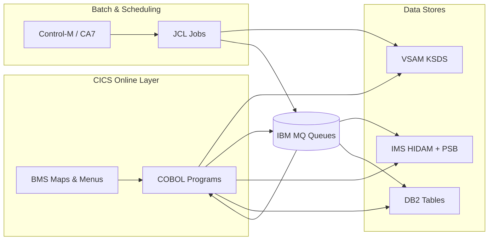
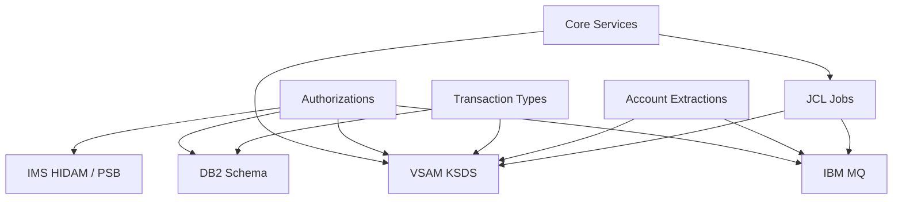

# System CardDemo - Overview for User Stories

**Version:** 2026-03-12  
**Purpose:** Single source of truth that lets engineers and Product Owners write well-structured user stories for the CardDemo mainframe modernization scenario.

---

## 📊 Platform Statistics
- **Technology Stack:** COBOL business programs running inside a CICS region, BMS maps for UI, copied datasets persisted in VSAM KSDS, orchestration by JCL with supplemental IMS/DB2/MQ integrations for optional features.
- **Architecture Pattern:** Transaction-driven layered services (Presentation via BMS, business logic in COBOL, data in VSAM) augmented by batch flows and publish/subscribe-inspired MQ bridges.
- **Key Capabilities:** Account/card management, transaction viewing, billing/statements, admin controls, batch job orchestration, and optional authorization, transaction-type, and MQ-based extraction extensions.
- **Supported Languages:** English-only BMS text and COBOL comments; no separate locale bundles exist.

## 👥 Actors & Journeys
- **Regular Cardholder:** Logs on through `CC00`, lands on `CM00`, and navigates to account view (`CAVW`/`COACTVW`), transaction list (`CT00`), billing (`CB00`), or statements (`CREASTMT`). The user flow mirrors the `Application-Flow-User.png` diagram: sign on, traverse menu tree, view/update data, and submit bill payments.
- **Admin:** Uses the CA00 Admin Menu to maintain users (`CU00`-`CU03`), manage transaction types (options 5/6 when the DB2 extension is installed), and run batch utilities; refer to `Application-Flow-Admin.png` for the control loop.
- **Batch/Integration Operator:** Executes JCL sequences (`ACCTFILE`, `CARDFILE`, `POSTTRAN`, etc.) and optionally schedules them via CA7/Control-M (see `app/scheduler` files) to keep VSAM datasets synchronized.

---

## 🏗️ High-Level Architecture

### Technology Stack
**Backend:** COBOL programs (layered around identification, environment, working storage, and procedure divisions) compiled into `AWS.M2.CARDDEMO.LOADLIB` and executed under CICS.  
**Frontend:** CICS BMS maps (`app/bms/*.bms`) drive the 3270-like UI; each transaction owns its mapset and map definitions (e.g., `COSGN00`/`COSGN0A` for signon).  
**Database:** VSAM KSDS datasets such as `AWS.M2.CARDDEMO.ACCTDATA.PS`, `TRANSACT.VSAM.KSDS`, `CARDXREF` store accounts, cards, customers, and transactions; optional IMS HIDAM (`DBPAUTP0`) and DB2 tables (`AUTHFRDS`, `TRANSACTION_TYPE`) host specialized workloads.  
**Batch:** JCL jobs in `app/jcl/*.jcl` orchestrate data loads and nightly processing (`POSTTRAN`, `CREASTMT`, `TRANEXTR`, etc.).  
**Event Fabric:** IBM MQ queues (`CARDDEMO.REQUEST.QUEUE`, `CARDDEMO.PAUTH.REQUEST/REPLY`) carry authorization/extraction messages.  
**Others:** Control-M/CA7 schedules (see `app/scheduler/CardDemo.ca7`), copybooks (`app/cpy/*.cpy`) centralize data structures, and CICS resource definitions (`app/csd/*.csd`) declare transactions and programs.

### Architectural Patterns
- **Service + Data Separation:** COBOL programs (like `COACTVWC`, `COCRDSLC`, `COPAUA0C`) pull copybook-defined structures and write to VSAM, IMS, or DB2 in a disciplined fashion.  
- **Presentation Layer:** Each map (for instance, `COSGN00.bms`) defines layout, prompt text, colors, and PF-key fields; no reusable base component exists—the UI is hand-crafted per transaction.  
- **Batch Orchestration:** JCL jobs sequence dataset refreshes and rely on Control-M/CA7 for scheduling; jobs talk to VSAM (`ACCTFILE`, `DALYTRAN`) and optionally to DB2/IMS.  
- **Optional Integrations:** Authorizations (MQ → IMS → DB2), transaction types (embedded SQL with DB2), and account extractions (MQ request/response) layer onto the base stack without altering core VSAM logic.  
- **Security & Access:** CICS transaction control and RACF credentials (`ADMIN001`, `USER0001`) gate flows.

---

## 📚 Module Catalog

<!-- MODULE_LIST_START -->
**Modules:** core-services, authorizations, transaction-types, account-extractions
<!-- MODULE_LIST_END -->

### 1. Core Services
**ID:** `core-services`  
**Purpose:** Deliver the base credit card lifecycle (sign-on, account/card maintenance, transactions, statements, billing) using VSAM, COBOL, BMS, and JCL.  
**Key Components:** `COACTVWC` (account view), `COACTUPC` (account update), `COCRDLI`/`COCRDSLC`/`COCRDUP` (credit card list/detail/update), `COTRN00C` (transaction list), BMS maps (`COSGN00`, `COMEN01`, `COTRN00`), copybooks (`CVACT01Y`, `CVCUS01Y`, `CVTRA06Y`), and batch templates in `app/jcl/` (`POSTTRAN`, `CREASTMT`, `TRANIDX`).  
**Public APIs:**
- `CC00 / COSGN00` – Sign-on screen asking for ID/password before routing to the menu.  
- `CM00 / COMEN01` – Main menu that branches into account, card, transaction, report, and admin flows.  
- `CAVW / COACTVWC` – Account view screen sourced from `ACCOUNT-RECORD`, with PF keys for drill-down.  
- `CT00 / COTRN00` – Transaction listing from `DALYTRAN`, supporting PF7/PF8 paging, search filters, and detail navigation.  
- `CB00 / COBIL00` – Bill payment map that posts transactions to `DALYTRAN` and updates balances.  
- Batch jobs such as `ACCTFILE`, `CARDFILE`, `POSTTRAN`, `CREASTMT`, `TRANIDX`, and `TRANBKP` – orchestrate dataset ingest, statement creation, and backup operations.
**User Story Examples:**
- As a cardholder, I want to view my account summary (`CAVW`) so I can confirm the available and current balances before making a payment.  
- As an operations analyst, I want the nightly `POSTTRAN` job to execute and update `TCATBALF` so that statement generation (`CREASTMT`) runs on fresh data.  
- As an admin, I want to update the address of a cardholder through `COACTUPC` so mailed statements align with the new ZIP code.

### 2. Authorizations
**ID:** `authorizations`  
**Purpose:** Simulate an MQ-driven authorization engine that validates requests, persists IMS history, flags fraud in DB2, and exposes CICS screens for review/purging.  
**Key Components:** `COPAUA0C` (MQ-triggered processor), `COPAUS0C`/`COPAUS1C` (summary/detail screens via map `COPAU00`/`COPAU01`), `COPAUS2C` (fraud marking updates), `CBPAUP0C` (purge job), MQ queues `AWS.M2.CARDDEMO.PAUTH.REQUEST/REPLY`, DB2 table `AUTHFRDS`, IMS DBD/PSBs (`DBPAUTP0`, `PSBPAUTL/B`), and copybooks (`CIPAUSMY`, `CCPAURQY`).  
**Public APIs:**
- `CP00` – Authorization request processor triggered by MQ; merges data from `CARDXREF`, runs business rules, replies to `AWS.M2.CARDDEMO.PAUTH.REPLY`, and inserts IMS segments.  
- `CPVS` – Authorization summary screen with PF7/PF8 scrolling and selection of records to inspect.  
- `CPVD` – Authorization detail screen where PF5 flags fraud and calls `COPAUS2C` to update DB2 `AUTHFRDS`.  
- `CBPAUP0J` – Batch purge job that expires authorizations, reclaims credit, and cleans MQ responses.
**User Story Examples:**
- As a fraud analyst, I want to review pending authorizations in `CPVS` so I can mark suspicious transactions before they complete.  
- As an integration engineer, I want to post an MQ authorization request with the documented CSV payload and receive a structured response in under 5 seconds.  
- As an ops engineer, I want to run `CBPAUP0J` nightly so expired authorizations are purged and the available credit is readjusted.

### 3. Transaction Types
**ID:** `transaction-types`  
**Purpose:** Provide a DB2-backed metadata layer for transaction categories, keeping VSAM copies in sync for runtime performance.  
**Key Components:** CICS transactions `CTTU` (`COTRTUP` map) for add/edit, `CTLI` (`COTRTLI` map) for list/update/delete, DB2 scripts (`CREADB21`, `TRANEXTR`, `MNTTRDB2`), tables `TRANSACTION_TYPE`/`TRANSACTION_TYPE_CATEGORY`, SQL declarations (`app/app-transaction-type-db2/dcl`), BMS screens, and `TRANEXTR` extracts for VSAM consumption.  
**Public APIs:**
- `CTTU` – Static embedded SQL handles insert/update operations with host variables and SQLCA for error reporting.  
- `CTLI` – Cursor-driven list that can fetch previous/next rows and enforces delete restrictions via DB2.  
- `CREADB21` – Batch job that creates DB2 tables and seeds data.  
- `TRANEXTR` – Batch job using `DSNTIAUL` to export DB2 rows into VSAM-friendly files.  
- `MNTTRDB2` – Batch maintenance job (`COBTUPDT`) for large-scale updates.
**User Story Examples:**
- As an admin, I want to add a new transaction type with `CTTU` so upcoming merchant categories have the right descriptions.  
- As a DB2 engineer, I want to run `TRANEXTR` nightly so the VSAM files used in `POSTTRAN` stay synchronized with the relational data.  
- As a data steward, I want to delete a category only when `CTLI` confirms there are no dependent records, aligning with `DELETE RESTRICT` rules.

### 4. Account Extractions
**ID:** `account-extractions`  
**Purpose:** Demonstrate MQ request/response patterns that extract VSAM data (system date, account details) for asynchronous consumers.  
**Key Components:** COBOL programs `CODATE01` (`CDRD`) and `COACCT01` (`CDRA`), CICS MQ definitions (`MQ01`, `CARDREQ`, `CARDRES`), message formats in the module README, and VSAM reads for account data.  
**Public APIs:**
- `CDRD` – Sends `DATE-REQUEST-MSG` to `CARDDEMO.REQUEST.QUEUE`, waits for `DATE-RESPONSE-MSG`, and displays the system date.  
- `CDRA` – Sends `ACCT-REQUEST-MSG` containing an account number, awaits `ACCT-RESPONSE-MSG` with 300 bytes of `ACCOUNT-DATA`, and displays it in CICS.  
- MQ queues `CARDDEMO.REQUEST.QUEUE` / `CARDDEMO.RESPONSE.QUEUE` that support request correlation.  
**User Story Examples:**
- As an integration engineer, I want to reuse the `CDRA` request/response pattern so downstream services can obtain account snapshots asynchronously.  
- As a scheduler owner, I want to ping `CDRD` to return the current system date so Control-M jobs align with the mainframe clock.

---

## 🔄 Architecture Diagram



## 🔌 Dependency Graph



## 📊 Data Models

### Account Record (`CVACT01Y`)
```cobol
01  ACCOUNT-RECORD.
    05  ACCT-ID                           PIC 9(11).
    05  ACCT-ACTIVE-STATUS                PIC X(01).
    05  ACCT-CURR-BAL                     PIC S9(10)V99.
    05  ACCT-CREDIT-LIMIT                 PIC S9(10)V99.
    05  ACCT-CASH-CREDIT-LIMIT            PIC S9(10)V99.
    05  ACCT-OPEN-DATE                    PIC X(10).
    05  ACCT-EXPIRAION-DATE               PIC X(10).
    05  ACCT-REISSUE-DATE                 PIC X(10).
    05  ACCT-CURR-CYC-CREDIT              PIC S9(10)V99.
    05  ACCT-CURR-CYC-DEBIT               PIC S9(10)V99.
    05  ACCT-ADDR-ZIP                     PIC X(10).
    05  ACCT-GROUP-ID                     PIC X(10).
    05  FILLER                            PIC X(178).
```

### Customer Record (`CVCUS01Y`)
```cobol
01  CUSTOMER-RECORD.
    05  CUST-ID                                 PIC 9(09).
    05  CUST-FIRST-NAME                         PIC X(25).
    05  CUST-MIDDLE-NAME                        PIC X(25).
    05  CUST-LAST-NAME                          PIC X(25).
    05  CUST-ADDR-LINE-1                        PIC X(50).
    05  CUST-ADDR-LINE-2                        PIC X(50).
    05  CUST-ADDR-LINE-3                        PIC X(50).
    05  CUST-ADDR-STATE-CD                      PIC X(02).
    05  CUST-ADDR-COUNTRY-CD                    PIC X(03).
    05  CUST-ADDR-ZIP                           PIC X(10).
    05  CUST-PHONE-NUM-1                        PIC X(15).
    05  CUST-PHONE-NUM-2                        PIC X(15).
    05  CUST-SSN                                PIC 9(09).
    05  CUST-DOB-YYYY-MM-DD                     PIC X(10).
    05  CUST-PRI-CARD-HOLDER-IND                PIC X(01).
    05  CUST-FICO-CREDIT-SCORE                  PIC 9(03).
    05  FILLER                                  PIC X(168).
```

### Daily Transaction Record (`CVTRA06Y`)
```cobol
01  DALYTRAN-RECORD.
    05  DALYTRAN-ID                             PIC X(16).
    05  DALYTRAN-TYPE-CD                        PIC X(02).
    05  DALYTRAN-CAT-CD                         PIC 9(04).
    05  DALYTRAN-SOURCE                         PIC X(10).
    05  DALYTRAN-DESC                           PIC X(100).
    05  DALYTRAN-AMT                            PIC S9(09)V99.
    05  DALYTRAN-MERCHANT-ID                    PIC 9(09).
    05  DALYTRAN-MERCHANT-NAME                  PIC X(50).
    05  DALYTRAN-MERCHANT-CITY                  PIC X(50).
    05  DALYTRAN-MERCHANT-ZIP                   PIC X(10).
    05  DALYTRAN-CARD-NUM                       PIC X(16).
    05  DALYTRAN-ORIG-TS                        PIC X(26).
    05  DALYTRAN-PROC-TS                        PIC X(26).
    05  FILLER                                  PIC X(20).
```

### Authorization Fraud Table (`AUTHFRDS`)
```sql
CREATE TABLE CARDDEMO.AUTHFRDS (
  CARD_NUM CHAR(16) NOT NULL,
  AUTH_TS TIMESTAMP NOT NULL,
  AUTH_RESP_CODE CHAR(2),
  AUTH_FRAUD CHAR(1),
  PRIMARY KEY (CARD_NUM, AUTH_TS)
);
```
Stores fraud-marked transactions after `COPAUS2C` sets `AUTH_FRAUD='Y'`.

### MQ Message Formats
- **Authorization request:** CSV payload of date/time, card number, expiry, auth type, processing code, amount, merchant codes, country codes, POS entry, merchant identity, and transaction ID.  
- **Authorization response:** Contains card number, transaction ID, auth ID, response code/reason, and approved amount.  
- **Account extraction (CDRD/CDRA):** Structured record with `REQUEST-TYPE`, `REQUEST-ID`, and either the `SYSTEM-DATE` or 300-byte `ACCOUNT-DATA` block.

---

## 📋 Business Rules by Module

### Core Services
- Only accounts with `ACCT-ACTIVE-STATUS='A'` are shown and posted; `COACTVWC` filters based on working-storage flags before writing.  
- `POSTTRAN` posts transactions into `DALYTRAN`, updates `TCATBALF`, and triggers `CREASTMT` to roll statements.  
- Bill payments create new transactions and adjust credit, while statements include all posted `DALYTRAN` entries per cycle.

### Authorizations
- Authorization data is validated against VSAM cross-references; unmatched requests are rejected before IMS insert.  
- Fraud markings via PF5 result in a DB2 `AUTHFRDS` entry and mark the IMS detail segment for audit.  
- `CBPAUP0J` removes expired authorizations (per TTL) and recalculates credit so that unmatched holds do not block spending.

### Transaction Types
- DB2 `DELETE RESTRICT` ensures admins cannot remove transaction types while dependent categories exist; the UI reflects this through cursor-driven deletes.  
- After any change via `CTTU` or `MNTTRDB2`, run `TRANEXTR` so VSAM transaction-type files remain synchronized.  
- The list screen uses SQL cursors (forward/backwards) to display page windows without pulling the entire table.

### Account Extractions
- MQ request/response flows use correlation IDs derived from `REQUEST-ID`; COBOL waits for matching `RESPONSE-ID` before rendering data.  
- `CDRD` always replies with the system date from `CODATE01`, which keeps downstream schedulers aligned.

---

## 🌐 Internationalization and Translation
Every prompt and label lives inside a BMS map (e.g., `COSGN00.bms` for sign-on), so there is no separate `locales` folder. Changing the displayed language requires editing map attributes (color, length, `INITIAL` text). The maps currently carry English literals; no `vue-i18n`/JSON configuration exists.

## 📋 Form and Listing Patterns
- **Forms:** Each screen (account view, transaction list, user management) is a BMS map with dedicated COBOL programs. Input validation is handled via working-storage flags (`WS-INPUT-FLAG`, `WS-EDIT-ACCT-FLAG`) and PF-key checks (`WS-PFK-FLAG` in `COACTVWC`).  
- **Lists:** Lists (e.g., transaction list `CT00` and authorization summary `CPVS`) render repeated rows with PF keys for navigation/paging and dedicated messages (`ERRMSG`, `CCARD-ERROR-MSG`). No component inheritance exists—every map is self-contained.  
- **Notifications:** Messages are displayed in BMS map fields (red `ERRMSG`) and via COBOL error messages managed in working storage; there is no global notification service.

## 🎯 User Story Templates
- **Template:** As a `[persona]` I want `[action]` so that `[value]`.  
- **Simple (1-2 pts):** Surface existing screens (e.g., add a new prompt to `COACTVWC`, change the default PF key on `COSGN00`).  
- **Medium (3-5 pts):** Add validation rules (e.g., enforce new email format, integrate a new VSAM file) or extend JCL flows.  
- **Complex (5-8 pts):** Modify integration points (`MQ` payload changes, two-phase DB2+IMS updates, new batch orchestration) that span multiple modules.
- **Acceptance Criteria Patterns:**  
  - Inputs must set COBOL flags and display messages when invalid.  
  - Any new data field must have a matching copybook entry and VSAM alignment.  
  - Batch/JCL steps must run within budget (see performance section) and log return codes.  
  - MQ interactions require defined correlation IDs, timely responses, and row-level logs to the MQ SRB spool.

## ⚡ Performance Budgets
- **Interactive:** CICS responses (account view, transaction list) < 2 seconds.  
- **MQ round-trip:** Authorization/extraction responses < 5 seconds (P95).  
- **Batch:** `POSTTRAN`, `CREASTMT`, and `TRANEXTR` < 60 minutes; dataset loads (`ACCTFILE`, `CARDFILE`) < 30 minutes each.  
- **Purges/extractions:** `CBPAUP0J`, `TRANEXTR` must finish within nightly windows (~30 minutes) to allow downstream flows to start.  
- **Statements:** `CREASTMT` should complete within 15 minutes after `POSTTRAN` ends.

## 🚨 Readiness Considerations
### Technical Risks
- **Subsidiary dependencies:** Optional modules require IMS DB (DBPAUT...), DB2 plans (`DB201PLN`), and MQ queues (`CARDREQ`, `CARDRES`); missing definitions block flows.  
- **Data synchronization:** Dual persistence (`TRANSACTION_TYPE` in DB2 vs VSAM) needs executed `TRANEXTR` to avoid stale reference data.  
- **Complex copybooks:** Many copybooks include `FILLER` and redefines, so new fields risk overwriting existing offsets.

### Tech Debt
- **Monolithic COBOL:** Single programs combine UI, validation, and business logic (e.g., `COACTVWC` mixes PFK handling with file reads).  
- **Limited automation:** Tests rely on the documented user flows; no unit/automated test suite exists for COBOL/JCL.  
- **Hard-coded text:** BMS maps and copybooks contain English text, requiring manual updates for any translation work.

### Sequencing for User Stories
1. **Foundation:** Define VSAM datasets, load sample data (`ACCTFILE`, `CARDFILE`, `CUSTFILE`), compile COBOL, install CICS resources (`COSGN00`, `COMEN01`, etc.).  
2. **Batch readiness:** Run and monitor JCL job order (`POSTTRAN`, `CREASTMT`, `TRANIDX`), hook Control-M/CA7 schedules (see `app/scheduler`).  
3. **Optional modules:** Install DB2 (`CREADB21`), IMS DB (`DBPAUTP0`/`PSB`), MQ queues, and enable transactions (`CTTU`, `CP00`, `CDRD`).  
4. **Integration verification:** Execute `TRANEXTR`, `CBPAUP0J`, MQ request/response tests to ensure cross-system flows succeed.

## 📈 Success Metrics
### Adoption
- **Target:** >80% of CardDemo sessions traverse account + transaction flows each release.  
- **Engagement:** Track bill payments (`CB00`) and statement generation (`CREASTMT`).  
- **Retention:** Reward stories that keep nightly batches green for 3+ days before closure.

### Business Impact
- **Metric 1:** Batch success rate ≥99% for critical jobs (`POSTTRAN`, `TRANEXTR`, `CBPAUP0J`).  
- **Metric 2:** Authorization MQ round trip < 5 seconds (P95).  
- **Metric 3:** Transaction-type extracts finish before daytime processing begins to keep VSAM in sync with DB2.

*Last updated: 2026-03-12*
