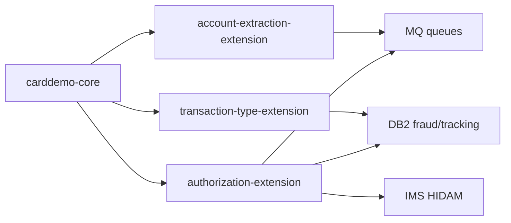

# System CardDemo - Overview for User Stories

**Version:** 1.0.0 (April 2025 baseline, reviewed March 11, 2026)  
**Purpose:** Single source of truth for engineers and Product Owners to author high-fidelity User Stories for CardDemo and its optional modernization extensions.

---

## 📊 Platform Statistics
- **Technology Stack:** COBOL/CICS online programs, JCL batch jobs, VSAM datasets, DB2 for extensions, IMS hierarchical storage, IBM MQ for async integration, BMS maps for 3270 UI.  
- **Architecture Pattern:** Classic z/OS mainframe stack where CICS transactions call COBOL business logic, persist to VSAM/DB2/IMS, and expose batch orchestration via JCL; optional MQ adapters handle asynchronous requests.  
- **Key Capabilities:** Account management, credit card lifecycle, transaction listing/posts, bill payments, statement reporting, authorization processing, transaction catalog management, MQ-based data extraction, scheduled batch refresh and posting.  
- **Supported Languages/Formats:** COBOL (Enterprise/IBM-style), JCL, BMS map language, VSAM copybooks, DB2 DDL/SQL, IMS DBD/PSB, MQ message descriptors.

---

## 🏗️ High-Level Architecture

### Technology Stack
**Backend:** COBOL + CICS transactions orchestrated via `jcl/` jobs and deployable via provided scripts.  
**Frontend:** 3270 BMS green-screen maps (`app/bms`, `app/app-*/*/bms`) rendered by CICS; no SPA/JS layer.  
**Database:** VSAM (KSDS) primary data stores such as `AWS.M2.CARDDEMO.ACCTDATA.PS`, `CARDDEMO.CARDDATA.PS`, `CARDDEMO.DALYTRAN.PS` plus optional DB2 schemas and IMS HIDAM segments.  
**Messaging:** IBM MQ queues (`AWS.M2.CARDDEMO.PAUTH.REQUEST/REPLY`, custom request/response queues for extraction).  
**Others:** IMS DB (root/child segments) for authorization tracking, DB2 tables for fraud/transaction metadata, shell scripts for local/remote compile & job orchestration.

### Architectural Patterns
- **Service Layer:** Each CICS transaction (e.g., `COACTVW`, `COTRA00`, `COPAUA0C`) wraps a COBOL program with well-defined entrypoints.  
- **Batch/Online separation:** Data refresh and posting executed via JCL series (`ACCTFILE`, `POSTTRAN`, `TRANBKP`), while day-to-day UI interactions go through CICS 3270 transactions.  
- **Event-Driven Extension Points:** MQ-triggered authorization processing and account extraction leverage queue listeners/correlators to extend the core VSAM data path.  
- **Data Duality:** Transaction metadata lives in VSAM for the online flow and synchronizes with DB2 via jobs like `TRANEXTR`, enabling analytics and admin maintenance.  

---

## 📚 Module Catalog

<!-- MODULE_LIST_START -->
**Modules:** carddemo-core, authorization-extension, transaction-type-extension, account-extraction-extension
<!-- MODULE_LIST_END -->

### 1. Carddemo Core
**ID:** `carddemo-core`  
**Purpose:** Deliver the mainframe credit card management surface: sign-on, customer/account/card maintenance, real-time transactions, bill payments, statement generation, and admin utilities.  
**Key Components:** COBOL programs under `app/cbl/`, BMS mapsets under `app/bms/`, copybooks in `app/cpy/` and `app/cpy-bms/`, VSAM datasets (`AWS.M2.CARDDEMO.*`), JCL jobs for refresh/posting (`app/jcl/`), scheduler helpers (`app/scheduler/`), and shell helpers in `scripts/`.  
**Public APIs:**  
- `CC00 / COSGN00C` – Sign-on gateway; starting point for all sessions.  
- `CM00 / COMEN01C` – Main menu aggregator that branches to account/card/transaction flows.  
- `CAVW / COACTVWC` – Account view.  
- `CAUP / COACTUPC` – Account update input validation and persistence.  
- `CCLI / COCRDLIC` and `CCDL / COCRDSLC` – Credit card list/detail screens.  
- `CT00 / COTRN00C`, `CT01 / COTRN01C`, `CT02 / COTRN02C` – Transaction list/view/add cycle.  
- `CB00 / COBIL00C` – Bill payment posting.  
- Batch JCL: `ACCTFILE`, `CARDFILE`, `TRANBKP`, `POSTTRAN`, `INTCALC`, `TRANIDX`, `OPENFIL` – orchestrated via `scripts/run_full_batch.sh` or direct JES submission.  
**User Story Examples:**  
- As a regular cardholder, I need to view my account balance and pending transactions so that I can reconcile charges before posting.  
- As an administrator, I want to update a customer’s mailing address and ensure downstream VSAM copies contain the change so that statement mailings stay accurate.  
- As an operator, I want to refresh account/card/transaction datasets nightly through the `run_full_batch.sh` sequence so that the next business day begins with clean data.

### 2. Authorization Extension
**ID:** `authorization-extension`  
**Purpose:** Simulate and exercise credit card authorization flows with IMS, DB2, and MQ so modernization teams can explore two-phase decisions, fraud tagging, and asynchronous messaging.  
**Key Components:** CICS programs (`COPAUA0C`, `COPAUS0C`, `COPAUS1C`, `COPAUS2C`), BMS maps (`COPAU00`, `COPAU01`), MQ listeners connected to `AWS.M2.CARDDEMO.PAUTH.REQUEST/REPLY`, IMS database segments (`DBPAUTP0`, `DBPAUTX0`, `PAUTSUM0`, `PAUTDTL1`), DB2 fraud table `AUTHFRDS`, `XAUTHFRD`, and batch purge job `CBPAUP0J`.  
**Public APIs:**  
- `CP00` / `COPAUA0C` – MQ-driven request processor returns approvals/declines and persists to IMS.  
- `CPVS` / `COPAUS0C` – Authorization summary browsing (PF7/PF8 scrolling).  
- `CPVD` / `COPAUS1C` – Authorization detail navigation and fraud marking (PF5).  
- `CBPAUP0J` – Batch purges expired authorizations from IMS/DB2.  
- MQ queue contract: inbound request includes card/date/merchant, outbound response carries auth code/response.  
**User Story Examples:**  
- As a fraud analyst, I want to mark an authorization as fraudulent and have it flow into `AUTHFRDS` so downstream analytics flag similar transactions.  
- As a developer, I want to replay MQ authorization requests against `CP00` with host-specified `AUTH-ID-CODE` so that we can validate client integrations.  
- As an operations engineer, I want to schedule `CBPAUP0J` so that stale records are removed nightly and credit availability restores.

### 3. Transaction Type Extension
**ID:** `transaction-type-extension`  
**Purpose:** Showcase DB2 integration patterns (static SQL, cursors, SQLCA error handling) and provide a relational-backed admin surface for transaction metadata that feeds the VSAM posting engine.  
**Key Components:** CICS transactions `CTTU` (`COTRTUPC`) and `CTLI` (`COTRTLIC`), DB2 tables `CARDDEMO.TRANSACTION_TYPE` and `TRANSACTION_TYPE_CATEGORY`, batch jobs `CREADB21`, `TRANEXTR`, `MNTTRDB2`, and control files (`app/app-transaction-type-db2/ctl`).  
**Public APIs:**  
- `CTTU` (add/edit) – Accepts static SQL host variables for CRUD operations.  
- `CTLI` (list/update/delete) – Demonstrates forward/backward cursor navigation plus referential integrity checking on delete.  
- `TRANEXTR` – ETL job that extracts DB2 canonical rows into VSAM-compatible files after each batch maintenance.  
- `MNTTRDB2` – Batch maintenance run for offline updates.  
**User Story Examples:**  
- As an admin, I want to add a new transaction type through `CTTU` so that it becomes selectable in the posting workflow.  
- As a data steward, I need to run `TRANEXTR` automatically after updating DB2 so that VSAM consumers see the latest metadata.  
- As a QA engineer, I want to test cursor pagination in `CTLI` so we can ensure the list view handles large result sets.

### 4. Account Extraction Extension
**ID:** `account-extraction-extension`  
**Purpose:** Provide MQ-based extraction demos for system date and account inquiry flows, highlighting asynchronous request/response handling between VSAM data and external clients.  
**Key Components:** CICS transactions `CDRD` (`CODATE01`), `CDRA` (`COACCT01`), MQ connection resources, request/response message formats (`DATE-REQUEST/RESPONSE`, `ACCT-REQUEST/RESPONSE`), and MQ queue definitions under `app/app-vsam-mq/README.md`.  
**Public APIs:**  
- `CDRD` – Sends a `DATE-REQUEST` and reads `DATE-RESPONSE` from MQ, ideal for monitoring.  
- `CDRA` – Accepts account number, sends `ACCT-REQUEST`, and renders `ACCT-RESPONSE` payload.  
- MQ queues (`CARDDEMO.REQUEST.QUEUE`, `CARDDEMO.RESPONSE.QUEUE`).  
**User Story Examples:**  
- As an integration engineer, I want `CDRD` to return the current system date via MQ so downstream services can sync clocks.  
- As a partner, I want to call `CDRA` with an account number and receive VSAM-backed details without directly logging into CICS.  
- As a release lead, I want this module to document message formats and correlation IDs so QA can automate regression tests.

---

## 🔄 Architecture Diagram
```mermaid
graph TD
  subgraph Core
    A[CICS + COBOL programs]
    B[VSAM datasets]
    C[BMS 3270 maps]
    D[JCL batch jobs]
    E[scripts/automation]
  end
  subgraph Extensions
    F[Authorization IMS/DB2/MQ]
    G[Transaction Type DB2]
    H[Account Extraction MQ]
  end
  subgraph Services
    I[IBM MQ queues]
    J[DB2 fraud & metadata]
    K[IMS HIDAM](K)
  end
  A -->|reads/writes| B
  A -->|renders| C
  D -->|refreshes| B
  E -->|triggers| D
  F -->|invokes| K
  F -->|publishes/consumes| I
  F -->|persists| J
  G -->|persists| J
  H -->|publishes/consumes| I
  A -->|depends on| F
  A -->|depends on| G
  A -->|depends on| H
```

## 🔗 Module Dependencies


---

## 👥 Actors and Journeys
- **Regular Users:** Authenticate via `CC00`, navigate the main menu (`CM00`), view/update account/card screens, review transactions, run bill payments, and request statements; all via 3270 BMS flows (PF keys for navigation, Enter to submit).  
- **Admin Users:** Access the Admin Menu (`CA00`) to manage users (`CU00-03`), update transaction types (`CTTU`, `CTLI`), and invoke accounting batch jobs when necessary; monitor dataset integrity via operator banner.  
- **External Clients/Automation:** Use MQ queues to send authorization requests (`AWS.M2.CARDDEMO.PAUTH.REQUEST`) or query system date/account details (`CARDDEMO.REQUEST.QUEUE`), then consume response payloads without using 3270 directly.

---

## 📊 Data Models
### Account Record (VSAM `AWS.M2.CARDDEMO.ACCTDATA.PS`, copybook `CVACT01Y`)
```cobol
01 ACCOUNT-RECORD.
   05 ACCOUNT-ID        PIC 9(9).
   05 CUSTOMER-ID       PIC 9(9).
   05 CARD-NUMBER       PIC X(16).
   05 AVAILABLE-CREDIT PIC S9(9)V99.
   05 BALANCE           PIC S9(9)V99.
   05 STATEMENT-DATE    PIC X(8).
```

### Transaction Record (VSAM `AWS.M2.CARDDEMO.DALYTRAN.PS`, copybook `CVTRA06Y`)
```cobol
01 TRANSACTION-RECORD.
   05 TRANSACTION-ID    PIC X(15).
   05 TRANSACTION-TYPE  PIC XX.
   05 TRANSACTION-AMT   PIC S9(11)V99.
   05 TRANSACTION-DATE  PIC X(8).
   05 ACCOUNT-ID        PIC 9(9).
   05 RESPONSE-CODE     PIC XX.
```

### Authorization Record (IMS `DBPAUTP0`, segment `PAUTSUM0`/`PAUTDTL1`)
- Root summary stores `CARD-NUM`, `AUTH-TS`, `AUTH-RESP-CODE`, `MERCHANT` info; child detail includes `FRAUD-FLAG`, `RESPONSE-REASON`, `APPROVED-AMT`.  
- DB2 table `AUTHFRDS` mirrors fraud-marked authorizations for analytics, keyed by `(CARD_NUM, AUTH_TS)` and indexed by `XAUTHFRD`.

---

## 📋 Business Rules by Module
### Carddemo Core - Rules
- Regular accounts cannot be deleted; account updates must go through `CAUP` and persist to VSAM dataset `AWS.M2.CARDDEMO.ACCTDATA.PS`.  
- Transaction posting (`POSTTRAN`) must run after data refresh jobs (`ACCTFILE`, `CARDFILE`, `TRANBKP`) to guarantee referential data.  
- Billing (`CB00`) requires a signed-on user and validates funds against `AVAILABLE-CREDIT` before writing to the transaction file.

### Authorization Extension - Rules
- MQ requests must include complete merchant and card data; `CP00` responds instantly with approval code and writes the attempt to IMS `PAUTSUM0/DTL1`.  
- Fraud marking (PF5 on `CPVD`) pushes the record into DB2 `AUTHFRDS` via `COPAUS2C` and flags the IMS row with `FRAUD-RPT-DATE`.  
- `CBPAUP0J` purges child segments of authorizations older than the current date to release credit.

### Transaction Type Extension - Rules
- Transaction categories in `TRANSACTION_TYPE_CATEGORY` have a `DELETE RESTRICT` FK to `TRANSACTION_TYPE`; the UI (`CTLI`) must prevent deletion when posts reference the code.  
- Cursor navigation honors forward/backward paging to support large result sets; each movement fetches via embedded SQL and populates BMS map fields (CICS host variables).  
- After maintenance, `TRANEXTR` must run to produce VSAM-friendly data so COBOL posting programs operate against up-to-date metadata.

### Account Extraction Extension - Rules
- `CDRD`/`CDRA` transmit MQ messages with predefined message formats (`REQUEST-TYPE` + correlation IDs).  
- Response queues must return status in `RESPONSE-TYPE` and the payload must be consumed within the same CICS task to avoid MQ hang-ups.  
- Account inquiry payloads include 300-byte `ACCOUNT-DATA` blocks that contain mirrored VSAM record fields to reduce downstream parsing complexity.

---

## 🌐 Internationalization and Translation
- The UI is composed of CICS/BMS 3270 maps (e.g., `COACTVW`, `COPAU00`).  
- Every label or prompt is hard-coded in the BMS map definitions and supporting copybooks; there is no translation/localization framework or JSON/i18n catalog.  
- If localization is required, introduce BMS map variations or runtime copybook overrides as there are no existing locale-specific directories.

---

## 📋 Form and Listing Patterns
- **Forms:** Each feature implements its own BMS map; there are no shared Vue/React components or reusable base dialogs. Input is collected via PF-key driven screens, with PF3/PF12 for exit, Enter to submit, and PF keys (PF5 fraud, PF7/PF8 scroll) for navigation.  
- **Validation:** COBOL field-level validation occurs on the server (e.g., `COACTUPC` inspects `ACCOUNT-<FIELD>` fields and returns BMS error messages such as `INSUFFICIENT CREDIT`). There are no client-side validation libs; the program sets `MSG-TEXT` and redisplays the map.  
- **Notifications:** Feedback is provided via BMS message line (positioned at map top); long-running operations rely on job abends rather than in-screen spinners.  
- **Listings:** Lists (transactions, authorizations) are rendered as row-based tables within BMS screens. Pagination uses PF7/PF8 to fetch previous/next pages using COBOL counters and VSAM record pointers.  

---

## 🎯 User Story Patterns
### Templates
- **Regular user:** As a [cardholder], I want [feature] so that [value].  
- **Admin:** As an [administrator], I want [control/maintenance task] so that [data quality/operational efficiency].  
- **Integrator:** As an [external system], I want [MQ endpoint] so that [sync/notification].

### Complexity Guidelines
- **Simple (1-2 pts):** CRUD task for an existing BMS screen (e.g., add a field to `COACTUP`).  
- **Medium (3-5 pts):** Introduce validation/business logic (e.g., new rule in `COPAUA0C`) or adjust DB2 cursor handling.  
- **Complex (6-8 pts):** Add a new MQ listener, extend IMS structure, or rework batch orchestration (`run_full_batch.sh`/JCL).  

### Acceptance Criteria Patterns
- **Online Flow:** Transactions must return to CICS within a negotiated duration (< 1 sec) and carry validated data back into VSAM/DB2.  
- **Batch:** Jobs must end with JES return code 0000 and data refresh order (account/card/transaction) must be preserved.  
- **MQ:** Queues must follow documented message structure with correlation IDs and respond on the reply queue within the same task.

---

## ⚡ Performance Budgets
- **Load time:** CICS screens should paint within the mainframe transaction limit (~1 second) to keep 3270 sessions responsive.  
- **API response:** MQ listeners (`CP00`, `CDRD`, `CDRA`) should hold requests < 500 ms before replying to avoid queue contention.  
- **Batch runtime:** `run_full_batch.sh` introduces 5–10 second waits between jobs; target ~120 seconds total for data refresh portion and no more than 300 seconds for the full posting+index cycle.  
- **Cache/Query:** VSAM read/write dominated by sequential access; maintain < 3 retries and keep DB2/IMS commits within a single unit of work.

---

## 🚨 Readiness Considerations
### Technical Risks
- **Legacy tooling:** COBOL/BMS code lacks automated unit tests → rely on regression loops via provided JCL and `run_full_batch.sh`.  
- **Environment sensitivity:** Deployment requires z/OS datasets, IMS/DB2 objects, and MQ setups; missing resources cause compile/execute failures.  

### Tech Debt
- **Manual job sequencing:** Current batch refresh script springs from hard-coded 5-second waits; consider modern job scheduler integration or improved idempotence.  
- **Documentation gap:** Manual copybook edits spread across dozens of programs; centralizing shared schemas (e.g., for `TRANSACTION-RECORD`) would reduce divergence.

### Sequencing for User Stories
- **Prerequisites:** Core dataset creation (`app/data` -> `AWS.M2.*`), base JCL load, CICS and MQ resource definition.  
- **Recommended order:** Stabilize `carddemo-core` flows first, then add `transaction-type-extension`, layer `authorization-extension`, and finally hook `account-extraction-extension` to leverage existing VSAM/DB2 artifacts.

---

## 📈 Success Metrics
### Adoption
- **Target:** 80% of modernization workshops reuse at least one optional module (authorization, MQ extraction, transaction types).  
- **Engagement:** Track MQ queue depth and job completions; aim for 0 failed MQ transactions per release.  
- **Retention:** Monitor nightly `run_full_batch.sh` success; recurring execution indicates the system remains operationally relevant.

### Business Impact
- **Metric 1:** Reduce dataset refresh fail rate to < 1 in 10 runs by automating JCL submission via `scripts/run_full_batch.sh`.  
- **Metric 2:** Cut fraud marking turnaround by ensuring `CPVD` → `AUTHFRDS` pipeline completes within 5 seconds, improving analytical reporting.

---

*Last updated: March 11, 2026*
