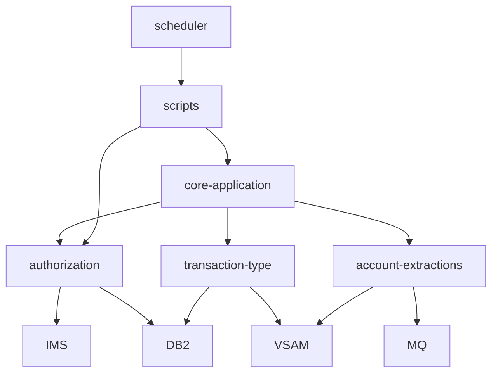

# System CardDemo - Overview for User Stories

**Version:** 1.0.0  
**Purpose:** Single source of truth for building focused user stories around the CardDemo credit-card management platform and its optional modernization extensions.

---

## 📊 Platform Statistics
- **Technology Stack:** z/OS COBOL and Assembler programs orchestrated by CICS (BMS screens), JCL batch streams, and shell automation scripts; data persisted in VSAM and optional IMS/DB2 databases; IBM MQ handles asynchronous integrations; RACF and dataset HLQs secure the stack.
- **Architecture Pattern:** Green-screen BMS + CICS command chain for interactive flows, complemented by JCL-driven batch jobs and MQ/DB2/IMS services for optional extensions.
- **Key Capabilities:** Real-time account/card/transaction maintenance, bill payments, statement generation, transaction reporting, optional modules for authorizations (IMS+DB2+MQ), transaction-type management (DB2), and MQ-based account extractions.
- **Supported Languages:** COBOL (core logic), JCL (batch/job control), Assembly macros (app/asm), embedded SQL (DB2 + IMS PSBs), IBM MQ definitions, Bash shell scripts (scripts/*) used for remote compile/submit workflows.

## 🏗️ High-Level Architecture

### Technology Stack
**Backend:** IBM CICS region on z/OS running `app/cbl` COBOL programs with GSAM/VSAM file access and `app/bms` mapsets.  
**Frontend:** 3270 terminals rendering BMS maps (COBOL-driven UI flows).  
**Database:** VSAM KSDS datasets such as `AWS.M2.CARDDEMO.ACCTDATA.PS` (accounts), `CARDDATA`, `CUSTDATA`, `DALYTRAN` (transactions). Optional IMS HIDAM (authorization summary/details) and DB2 tables (`CARDDEMO.TRANSACTION_TYPE`, `AUTHFRDS`).  
**Cache:** VSAM indexes and MB (COBOL) overlays maintain fast lookups for accounts and cross-references.  
**Others:** IBM MQ queues for authorization and account/MQ patterns, RACF for security, CA-7/Control-M scheduler definitions (`app/scheduler`) for orchestrating nightly loads.

### Architectural Patterns
- **BMS+CICS Transactions:** Each green-screen interaction is defined by a map in `app/bms/*.bms` paired with a COBOL program in `app/cbl/`. Copybooks (app/cpy) centralize data structures, enabling consistent validation and messaging.
- **Batch Orchestration:** JCL job scripts (`app/jcl/*.jcl`) refresh VSAM files, load reference data, and trigger processing programs; helper scripts under `scripts/` (e.g., `run_full_batch.sh`) automate FTP submission into JES.
- **Optional Subsystems:** Authorization flows apply MQ request/response + IMS/DB2 persistence (app/app-authorization-ims-db2-mq). Transaction type admin operations live entirely in DB2 (app/app-transaction-type-db2). Account extraction demos rely on MQ/VSAM (app/app-vsam-mq).
- **Security:** RACF-protected datasets pair with the user dataset `AWS.M2.CARDDEMO.USRSEC.PS` for login credentials (ADMIN001/PASSWORD, USER0001/PASSWORD) referenced in `app/data` samples.
- **Data Synchronization:** Batch streams extract DB2/IMS data into VSAM for the high-speed, 3270-driven path (e.g., `TRANEXTR` job for transaction types).

## 📚 Module Catalog

<!-- MODULE_LIST_START -->
**Modules:** core-application, authorization, transaction-type, account-extractions
<!-- MODULE_LIST_END -->

### 1. Core Application
**ID:** `core-application`  
**Purpose:** Provide the foundational credit-card management flows (sign-on, account/card/transaction screens, statements, bill payments, admin tasks) that modernization scenarios exercise.  
**Key Components:** COSGN00C/CC00 signon routing to COMEN01C (main menu), `COACTVW`/`COACTUP` account view/update, `COCRDLI`/`COCRDUP` card catalog, `COTRN00C` series for transaction lists, `COBIL00C` bill payments, administrative screens (`CA00`, `CU00`-`CU03`) plus VSAM datasets (`app/data`), copybooks (`app/cpy`), and JCL jobs handling data refresh (`ACCTFILE`, `TRANBKP`, `CREASTMT`).  
**Public APIs:**
- `CC00 (COSGN00C)` – user sign-on and dispatch to online menus.  
- `CM00 (COMEN01C)` – main menu that branches to account, card, transaction, and admin flows.  
- `CAVW/CAUP` (COACTVW/COACTUP) – view and update account master data.  
- `CCLI`/`CCDL`/`CCUP` – card list/view/update operations.  
- `CT00-CT02` (COTRN00C/1C/2C) – transaction listing, detail, and add/update.  
- `CB00 (COBIL00C)` – bill payment and statement generation.  
- Admin CRUD (`CA00`, `CU00`-`CU03`) – user list/create/edit/delete.  
- Batch jobs (`POSTTRAN`, `CREASTMT`, `TRANIDX`, `OPENFIL`) submitted via JES, some automated by `scripts/run_full_batch.sh`.
**User Story Examples:**
- As a cardholder, I want to scroll through `CT00` transactions so I can reconcile the latest activities before a statement post.  
- As an account admin, I want to update the billing address via `CAUP` so the system mails statements to the correct location.  
- As an operator, I want to run `POSTTRAN` and `CREASTMT` in sequence (via `scripts/run_full_batch.sh`) so nightly balances remain synchronized.

### 2. Authorization
**ID:** `authorization`  
**Purpose:** Add an MQ-triggered authorization pipeline that records request/response pairs, stores pending authorizations in IMS (PAUTSUM0/PAUTDTL1), marks fraud in DB2 (`AUTHFRDS`), and offers summary/details screens plus a purge job.  
**Key Components:** CICS programs `COPAUA0C`, `COPAUS0C`, `COPAUS1C`, `COPAUS2C`; BMS mapsets `COPAU00`/`COPAU01`; IMS artifacts (`DBPAUTP0`, `DBPAUTX0`, PSBs) and DB2 artefacts (`AUTHFRDS`, `XAUTHFRD`); batch job `CBPAUP0J`; MQ queue definitions for `AWS.M2.CARDDEMO.PAUTH.REQUEST/REPLY`.  
**Public APIs:**
- `CP00` – MQ-triggered authorization intake (requests from any MQ client).  
- `CPVS` / `CPVD` – pending authorization summary and detail view.  
- `CBPAUP0J` – nightly purge of expired authorizations and rollback of hold amounts.  
- MQ queues (`PAUTH.REQUEST` / `PAUTH.REPLY`) with comma-separated message format (card number, merchant info, transaction amount, response codes).  
**User Story Examples:**
- As a fraud analyst, I want to mark a pending authorization as fraudulent via `COPAUS1C` so the transaction is persisted in `AUTHFRDS` for analytics.  
- As a cloud POS emulator, I want to submit an MQ request to `PAUTH.REQUEST` and read the reply so I can simulate real-time declines.

### 3. Transaction Type
**ID:** `transaction-type`  
**Purpose:** Demonstrate DB2 CRUD and cursor techniques for maintaining transaction type metadata while synchronizing reference data back to VSAM for the legacy transaction engine.  
**Key Components:** CICS transactions `CTTU` (add/edit) and `CTLI` (list/update/delete), DB2 tables (`CARDDEMO.TRANSACTION_TYPE`, `TRANSACTION_TYPE_CATEGORY`), batch programs `TRANEXTR` (extract latest DB2 rows) and `MNTTRDB2` (batch maintenance), and precompiler artifacts (`app/app-transaction-type-db2/dcl`, `ddl`).  
**Public APIs:**
- `CTTU` / `CTLI` – admin CRUD screens utilizing embedded static SQL with SQLCA checks.  
- `TRANEXTR` / `CREADB21` / `MNTTRDB2` – JCL-driven jobs that refresh reference data and load VSAM-compatible files consumed by `core-application`.  
**User Story Examples:**
- As an admin, I want to batch-approve a new transaction category via `CTTU` so downstream reporting groups can rely on a DB2-backed enum.  
- As an operator, I want `TRANEXTR` to publish the refreshed file so `CT00` transactions can read consistent category labels.

### 4. Account Extractions
**ID:** `account-extractions`  
**Purpose:** Showcase MQ+VSAM integration for asynchronous data extraction, allowing external systems to request the system date (`CDRD`) or detailed account data (`CDRA`).  
**Key Components:** CICS programs `CODATE01`, `COACCT01`, MQCONN/queue definitions for `CARDDEMO.REQUEST.QUEUE` and `CARDDEMO.RESPONSE.QUEUE`, BMS definitions for `CDRD`/`CDRA`, and COBOL data structures for MQ message formats (`DATE-REQUEST-MSG`, `ACCT-RESPONSE-MSG`).  
**Public APIs:**
- `CDRD` – system-date MQ request/response loop (request type `DATE`, response carries `SYSTEM-DATE`).  
- `CDRA` – account-data MQ request that replies with a 300-byte account payload from VSAM.  
- MQ queue definitions (`CARDDEMO.REQUEST.QUEUE` / `.RESPONSE.QUEUE`) and CICS-MQ resources in `app/app-vsam-mq/csd`.
**User Story Examples:**
- As a distributed service, I want to issue `CDRA` MQ requests to fetch account data so I can populate a mobile dashboard.  
- As a support engineer, I want `CDRD` to return the z/OS system date over MQ so downstream clients can stay in sync.

## 🧑‍🤝‍🧑 Actors & Journeys
- **Regular User:** Signs in via `CC00`, traverses `CM00` (main menu) to view/update accounts (`CAVW`, `CAUP`), review transactions (`CT00`), and submit bill payments (`CB00`).  
- **Admin User:** Logs in and opens `CA00`; manages users (`CU00`-`CU03`), transaction types (`CTTU`/`CTLI` when DB2 module installed), and optional authorizations.  
- **Batch Operator:** Uses the `scripts/run_full_batch.sh` workflow or submits JCL directly to refresh datasets (`ACCTFILE`, `TRANBKP`, etc.) and kick off posting/statement jobs.  
- **MQ/Cloud Client:** Sends messages to `PAUTH.REQUEST`, `CARDDEMO.REQUEST.QUEUE`, or reads from reply queues to simulate partner systems.

## 🔄 Architecture Diagram
```mermaid
flowchart LR
    Terminal[3270 Terminal]
    Terminal -->|BMS PF Keys| CICS[CICS Region<br/>(app/cbl + app/bms + copybooks)]
    CICS --> VSAM[VSAM KSDS Datasets<br/>(app/data)]
    CICS --> MQ[IBM MQ Queues]
    CICS --> DB2[DB2 Tables]
    CICS --> IMS[IMS HIDAM]
    CICS -->|JCL| JES[JES2/JES3 via app/jcl]
    JES --> VSAM
    JES --> DB2
    JES --> CICS
    MQ --> Authorization[Authorization Module]
    Authorization --> IMS
    Authorization --> DB2
    MQ --> AccountExtra[Account Extraction Module]
    AccountExtra --> VSAM
    TransactionType[Transaction-Type Module] --> DB2
    TransactionType --> VSAM
    scripts[Shell Automation<br/>(scripts/*)] -.-> JES
    scheduler[CA-7 / Control-M<br/>(app/scheduler)] --> JES
```

## 🔀 Dependency Diagram


## 📊 Data Models
### CUSTOMER-RECORD (`app/cpy/CVCUS01Y.cpy`)
```cobol
01  CUSTOMER-RECORD.
    05  CUST-ID                                 PIC 9(09).
    05  CUST-FIRST-NAME                         PIC X(25).
    05  CUST-MIDDLE-NAME                        PIC X(25).
    05  CUST-LAST-NAME                          PIC X(25).
    05  CUST-ADDR-LINE-1                        PIC X(50).
    05  CUST-ADDR-LINE-2                        PIC X(50).
    05  CUST-ADDR-LINE-3                        PIC X(50).
    05  CUST-ADDR-STATE-CD                      PIC X(02).
    05  CUST-ADDR-COUNTRY-CD                    PIC X(03).
    05  CUST-ADDR-ZIP                           PIC X(10).
    05  CUST-PHONE-NUM-1                        PIC X(15).
    05  CUST-PHONE-NUM-2                        PIC X(15).
    05  CUST-SSN                                PIC 9(09).
    05  CUST-GOVT-ISSUED-ID                     PIC X(20).
    05  CUST-DOB-YYYY-MM-DD                     PIC X(10).
    05  CUST-EFT-ACCOUNT-ID                     PIC X(10).
    05  CUST-PRI-CARD-HOLDER-IND                PIC X(01).
    05  CUST-FICO-CREDIT-SCORE                  PIC 9(03).
    05  FILLER                                  PIC X(168).
```

### DALYTRAN-RECORD (`app/cpy/CVTRA06Y.cpy`)
```cobol
01  DALYTRAN-RECORD.
    05  DALYTRAN-ID                             PIC X(16).
    05  DALYTRAN-TYPE-CD                        PIC X(02).
    05  DALYTRAN-CAT-CD                         PIC 9(04).
    05  DALYTRAN-SOURCE                         PIC X(10).
    05  DALYTRAN-DESC                           PIC X(100).
    05  DALYTRAN-AMT                            PIC S9(09)V99.
    05  DALYTRAN-MERCHANT-ID                    PIC 9(09).
    05  DALYTRAN-MERCHANT-NAME                  PIC X(50).
    05  DALYTRAN-MERCHANT-CITY                  PIC X(50).
    05  DALYTRAN-MERCHANT-ZIP                   PIC X(10).
    05  DALYTRAN-CARD-NUM                       PIC X(16).
    05  DALYTRAN-ORIG-TS                        PIC X(26).
    05  DALYTRAN-PROC-TS                        PIC X(26).
    05  FILLER                                  PIC X(20).
```

## 📋 Business Rules by Module
### Core Application - Rules
- **Authenticated Access:** Only RACF-authenticated IDs (e.g., ADMIN001, USER0001 stored in `AWS.M2.CARDDEMO.USRSEC.PS`) can reach `CC00`/`CM00`.  
- **Account Ownership:** Updates via `CAUP` verify the requesting ID matches the account owner before writing to `CVACT01Y`.  
- **Batch Consistency:** `POSTTRAN` must run after the nightly data refresh jobs (`ACCTFILE`, `TRANBKP`) so transaction posting aligns with datasets used by interactive screens.

### Authorization - Rules
- **Validation:** MQ requests must supply card, merchant, amount, and request IDs; incomplete payloads are rejected in `COPAUA0C`.  
- **Fraud Tracking:** Marking a transaction as fraudulent persists a row to `AUTHFRDS` with `AUTH_ID_CODE` and timestamps captured in `COPAUS2C`.  
- **Retention:** `CBPAUP0J` purges expired authorizations so IMS segments (`PAUTSUM0`, `PAUTDTL1`) stay lean.

### Transaction Type - Rules
- **Referential Integrity:** Deleting from `TRANSACTION_TYPE_CATEGORY` refuses if a transaction type still referenced by VSAM-bound files or `CT00`.  
- **Dual Source Updates:** `TRANEXTR` must propagate DB2 changes to VSAM copies to keep `COTRN` screens in sync.  
- **Cursor Discipline:** `CTLI` and `MNTTRDB2` use forward/backward cursors with SQLCA status checks before committing.

### Account Extractions - Rules
- **Message Correspondence:** Correlate request/response pairs using the `REQUEST-ID` field so MQ clients read the matching `ACCT-RESPONSE-MSG`.  
- **Data Source:** All account responses originate from VSAM (`app/data/ACCTDATA`) and honor the same validation rules executed by `COACTVW`.  
- **Error Handling:** Any MQ error surfaces on the BMS message area (PF keys) and the request is retried or logged by the caller.

## 🌐 Internationalization and Translation
### i18n File Structure
- The UI text lives inside BMS map definitions under `app/bms/*.bms` and is authored in US English.  
- No JavaScript/TypeScript localization libraries exist; languages are tied to the 3270 mapsets themselves.  
- BMS error strings and labels reuse copybooks in `app/cpy-bms` for consistent naming (e.g., `COPAU00`).

## 📋 Form and Listing Patterns
### Component Structure Analysis
- **Forms:** Each form is a BMS map plus a COBOL program that references shared copybooks (`app/cpy`). The same map handles multiple PF keys, and validation is performed in COBOL (EVALUATE + IF statements) before writing to VSAM or invoking DB2/MQ services.  
- **Lists:** Transaction lists (`CT00`) and transaction-type listings (`CTLI`) rely on a BMS table region with PF7/PF8 for paging, and selection is captured via `S` indicators before passing control to detail screens.  
- **Notifications:** Error and success messages render in the BMS message line at the top of each screen; COBOL programs set the message text before issuing `SEND MAPSET`.  
- **Patterns:** No shared JavaScript components—reusability comes from copybooks (e.g., `CVCUS01Y`), shared BMS macros, and modular programs (COBOL sections invoked by multiple transactions).

## 🎯 User Story Development Patterns
### Templates
- **Core Account:** As a cardholder, I want to view/update my account/card/transaction lines so that I can reconcile activity before a statement posts.  
- **Optional Authorization:** As a fraud analyst, I want to review pending authorizations via MQ-triggered `CPVS` so that I can approve or mark them as fraudulent within IMS/DB2.  
- **DB2 Admin:** As an admin, I want to add/edit transaction-type metadata in DB2 so that downstream VSAM and reporting flows interpret new categories consistently.

### Story Complexity
- **Simple (1-2 pts):** Adjust a BMS label, add validation text, or tweak a `COBIL00C` field (no data schema change).  
- **Medium (3-5 pts):** Introduce a new account field (update copybook + VSAM file) or add a DB2 column referenced by `CTTU`.  
- **Complex (5-8 pts):** Integrate a new MQ field/queue into the authorization pipeline or implement a batch job that reads from multiple datasets and writes to IMS/DB2.

### Acceptance Criteria Patterns
- **Authentication:** Must reject unauthorized IDs via RACF and surface a BMS message.  
- **Validation:** Must confirm field-level rules defined in copybooks (e.g., `CUST-ADDR-ZIP` length).  
- **Performance:** CICS transactions respond within the performance budget (see below).  
- **Error Handling:** MQ failures log an explanation and leave MQ message on the backout queue.

## ⚡ Performance Budgets
- **CICS Response Time:** 95% of interactive screens return within 2.5 seconds (single `SEND MAPSET`).  
- **MQ Round-Trip:** Authorization and extraction requests complete within 500 ms from queue put to response fetch under nominal load.  
- **Batch Step Time:** Core posting/balance jobs (`POSTTRAN`, `CREASTMT`, `TRANIDX`) should complete each step within 90 seconds to keep nightly windows manageable.  
- **DB2 Queries:** Transaction-type cursors (`CTLI`) open/close within 2 seconds; embedded SQL uses `SQLCA` to detect timeouts.  
- **Cache/VSAM Hit Ratio:** Aim for >99% dataset hits via KSDS indexes; rebalancing occurs after `TRANEXTR` publishes new VSAM files.

## 🚨 Readiness Considerations
### Technical Risks
- **Risk 1:** Optional modules require IMS, DB2, and MQ subsystems; mitigation is to ensure those components are available in the target mainframe environment before enabling extensions (`README` installation steps).  
- **Risk 2:** Signing on with `ADMIN001`/`USER0001` in non-HLQ environments can collide with naming; the install guide provides HLQ-specific dataset names that must be configured precisely.

### Tech Debt
- **Debt 1:** COBOL + BMS lacks automated unit tests; recommend pairing future stories with regression smoke jobs triggered via `scripts/run_full_batch.sh`.  
- **Debt 2:** Copybooks and BMS maps remain manually maintained—update documentation whenever copybook structures (e.g., `CUSTOMER-RECORD`) change to keep story acceptance clear.

### Sequencing for US
1. Confirm the base datasets (`AWS.M2.CARDDEMO.*`) exist via `app/jcl` jobs before touching optional modules.  
2. Install the desired subsystem (DB2 for transaction types, IMS/MQ for authorizations, MQ for extractions).  
3. Use the provided scripts (`scripts/run_full_batch.sh`, `run_posting.sh`) to refresh data before user-facing stories run.  
4. Validate by running `CT00`/`CTLI` and relevant MQ transactions to ensure new fields flow through copybooks and datasets.

## 📈 Success Metrics
### Adoption
- **Target:** Every modernization sprint references the core account + transaction flows; optional modules should be exercised by at least 2 migration proof-of-concepts per quarter.  
- **Engagement:** Monitor usage by confirming batch jobs and MQ queues are hit (e.g., `CBPAUP0J`, `CARDDEMO.REQUEST.QUEUE`).  
- **Retention:** Keep nightly batch jobs stable (errors <1%) so teams rely on the dataset refresh pipeline.

### Business Impact
- **Metric 1:** Reduce manual dataset refresh time by leveraging `scripts/run_full_batch.sh`, ensuring jobs complete within the performance budget.  
- **Metric 2:** Demonstrate modernization readiness by successfully replicating an MQ authorization flow (IMS + DB2) in every new environment.

*Last updated: March 10, 2026*
