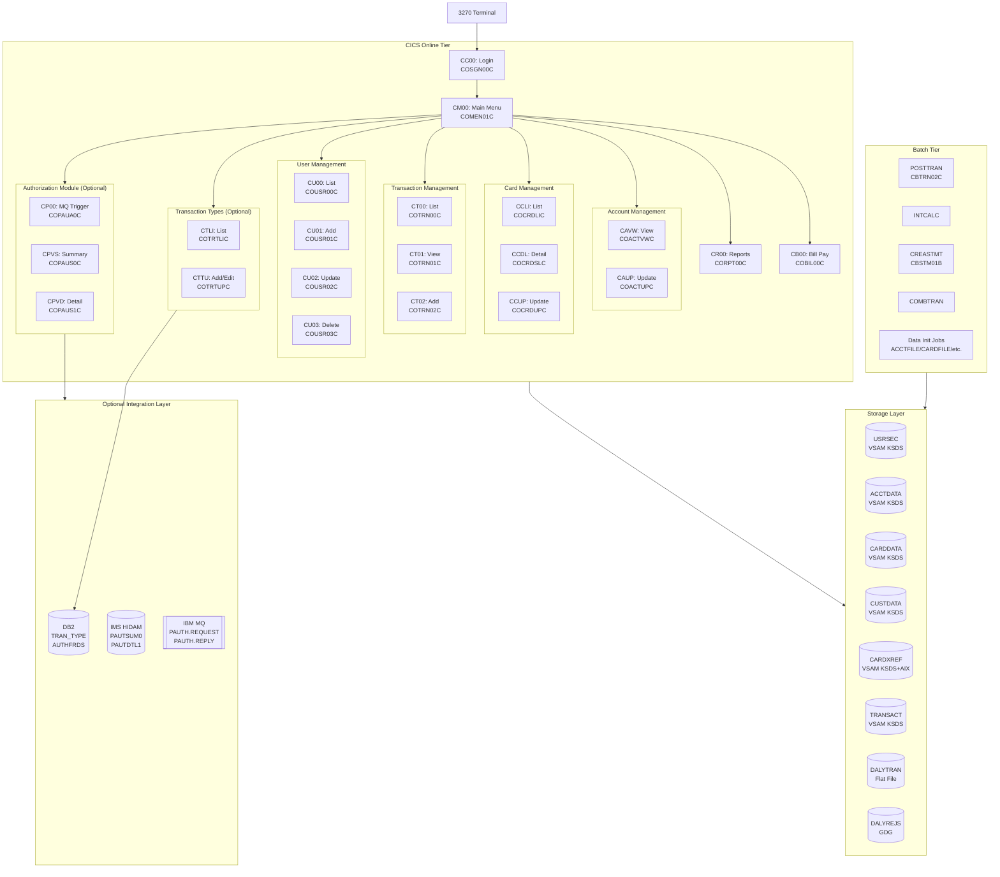
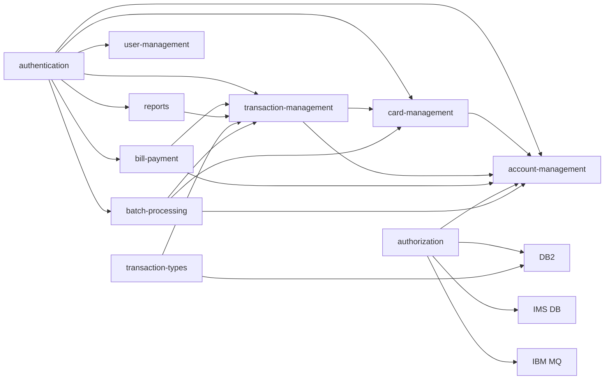

# System CardDemo - Overview for User Stories

**Version:** 2026-03-11  
**Purpose:** Single source of truth for creating well-structured User Stories

---

## 📊 Platform Statistics

- **Technology Stack:** IBM COBOL, CICS, VSAM, JCL, BMS, DB2 (optional), IMS DB (optional), IBM MQ (optional)
- **Architecture Pattern:** Pseudo-conversational CICS online processing + JCL batch scheduling
- **Key Capabilities:** Credit card account management, card issuance, transaction processing, billing, user administration, optional real-time authorization
- **Supported Languages:** English (primary UI language on 3270 terminals)
- **Total CICS Programs:** ~30 online programs, 17 BMS mapsets
- **Total Batch Programs:** ~10 batch programs + 5 utility programs
- **Optional Modules:** Authorization (IMS+DB2+MQ), Transaction Types (DB2), VSAM-MQ Bridge

---

## 🏗️ High-Level Architecture

### Technology Stack

**Online (CICS):** IBM COBOL II / COBOL for z/OS, CICS Transaction Server  
**Batch:** IBM COBOL, JCL, JES2/JES3  
**Terminal UI:** IBM 3270 BMS (Basic Mapping Support) screens — no web frontend  
**Primary Storage:** VSAM KSDS/AIX datasets  
**Optional DB:** IBM DB2 (transaction types, fraud records)  
**Optional MQ:** IBM MQ (authorization request/reply queues)  
**Optional IMS:** IMS HIDAM (authorization history)  
**Security:** RACF integration, encrypted passwords in VSAM  
**Utilities:** SORT, IDCAMS, IEBGENER, assembler utilities (MVSWAIT, COBDATFT)

### Architectural Patterns

- **Pseudo-Conversational:** Each CICS screen is a separate transaction; state passed via COMMAREA
- **COMMAREA Pattern:** Shared working storage structure passed across screen transitions
- **VSAM KSDS:** Direct key-access file I/O for accounts, cards, customers, transactions, users
- **Alternate Index (AIX):** Card-to-Account cross-reference via CARDAIX path
- **Batch-Online Separation:** Batch jobs process daily files; online CICS programs provide real-time access
- **Modular Add-on Design:** Core VSAM app can be extended with DB2, IMS, MQ optional modules
- **GDG (Generation Data Group):** Versioned rejection files (DALYREJS+1)

### Navigation Flow

```
CC00 (Login) → CM00 (Main Menu)
  ├── Account Functions → CAVW (View) / CAUP (Update)
  ├── Card Functions    → CCLI (List) → CCDL (Detail) / CCUP (Update)
  ├── Transaction Funcs → CT00 (List) → CT01 (View) / CT02 (Add)
  ├── Reports          → CR00 (Report Screen)
  ├── Bill Payment     → CB00 (Bill Pay)
  ├── User Admin       → CU00 (List) → CU01 (Add) / CU02 (Update) / CU03 (Delete)
  └── Admin Menu       → CA00 → User Mgmt / Txn Types (optional)
```

---

## 📚 Module Catalog

<!-- MODULE_LIST_START -->
**Modules:** authentication, account-management, card-management, transaction-management, reports, bill-payment, user-management, batch-processing, authorization, transaction-types
<!-- MODULE_LIST_END -->

---

### 1. Authentication
**ID:** `authentication`  
**Purpose:** User login/logout and session security for all CICS transactions  
**Key Components:** `COSGN00C` (signon program), `COSGN00` (BMS mapset), `CSUSR01Y` (user record copybook)  
**VSAM Datasets:** `USRSEC.VSAM.KSDS` (user security file)  
**Transaction ID:** `CC00`

**Public Interfaces:**
- Screen `CC00` — Accept User ID + Password, validate against USRSEC VSAM, set session context
- PF3 — Exit/return to OS
- Error field — Color-coded error messages on invalid credentials

**Data Fields:**
- `USRIDINI` — User ID input (8 chars)
- `PASSWDINI` — Password input (8 chars, masked)
- `CURADATE`, `TRNNAMEI` — Date/transaction display

**User Story Examples:**
- As a **bank operator**, I want to log in with my user ID and password so that I can access authorized card management functions
- As a **security admin**, I want invalid login attempts to display a clear error message so that users know their credentials are wrong
- As a **system admin**, I want sessions to terminate cleanly on PF3 so that terminals are not left in an open state

---

### 2. Account Management
**ID:** `account-management`  
**Purpose:** View and update credit card account details including balances, credit limits, and status  
**Key Components:** `COACTVWC` (view program), `COACTUPC` (update program), `COACTVW`/`COACTUP` (BMS mapsets), `CVACT01Y` (account copybook), `CVACT02Y` (account-card mapping), `CVACT03Y` (account group)  
**VSAM Datasets:** `ACCTDATA.VSAM.KSDS`  
**Transaction IDs:** `CAVW` (view), `CAUP` (update)

**Public Interfaces:**
- Screen `CAVW` — Display account: ID, status, balances (current/credit/cash), limits, dates
- Screen `CAUP` — Edit account: credit limit, cash limit, account status, expiry date
- PF3 — Return to main menu

**Data Model (CVACT01Y):**
```cobol
01 ACCOUNT-RECORD.
   05 ACCT-ID                    PIC 9(11).
   05 ACCT-ACTIVE-STATUS         PIC X(01).    -- Y/N
   05 ACCT-CURR-BAL              PIC S9(10)V99.
   05 ACCT-CREDIT-LIMIT          PIC S9(10)V99.
   05 ACCT-CASH-CREDIT-LIMIT     PIC S9(10)V99.
   05 ACCT-OPEN-DATE             PIC X(10).    -- YYYY-MM-DD
   05 ACCT-EXPIRAION-DATE        PIC X(10).
   05 ACCT-REISSUE-DATE          PIC X(10).
   05 ACCT-CURR-CYC-CREDIT       PIC S9(10)V99.
   05 ACCT-CURR-CYC-DEBIT        PIC S9(10)V99.
   05 ACCT-GROUP-ID              PIC X(10).
```

**Business Rules:**
- Account status `Y` = Active; `N` = Inactive
- Credit limit must be positive and within system-defined maximum
- Cash credit limit must be ≤ credit limit
- Balance cannot exceed credit limit during transaction posting
- Expiry date must be in the future for account updates

**User Story Examples:**
- As a **CSR (Customer Service Representative)**, I want to view an account's current balance and credit limit so that I can answer customer inquiries
- As a **credit officer**, I want to update a customer's credit limit so that I can respond to limit increase requests

---

### 3. Card Management
**ID:** `card-management`  
**Purpose:** List, view, and update credit cards associated with accounts  
**Key Components:** `COCRDLIC` (list program), `COCRDSLC` (detail/select program), `COCRDUPC` (update program), `COCRDLI`/`COCRDSL`/`COCRDUP` (BMS mapsets), `CVCARD01Y` (card record copybook), `CVACT02Y` (card-account mapping)  
**VSAM Datasets:** `CARDDATA.VSAM.KSDS`, `CARDXREF.VSAM.KSDS` (CARDAIX alternate index)  
**Transaction IDs:** `CCLI` (list), `CCDL` (detail), `CCUP` (update)

**Public Interfaces:**
- Screen `CCLI` — Pageable list of cards (10-15 per page), select with 'S'
- Screen `CCDL` — Card detail: number (masked), expiry, status, limits
- Screen `CCUP` — Update: card status, credit limit, cash limit, expiry date
- PF7/PF8 — Page up/down through card list
- PF3 — Return to menu

**Data Model (CVCARD01Y):**
```cobol
01 CARD-RECORD.
   05 CARD-NUM                   PIC X(16).   -- Stored encrypted
   05 CARD-ACCT-ID               PIC 9(11).
   05 CARD-CVV-CD                PIC 9(03).
   05 CARD-EMBOSSED-NAME         PIC X(50).
   05 CARD-EXPIRAION-DATE        PIC X(10).
   05 CARD-ACTIVE-STATUS         PIC X(01).   -- Y/N
```

**Business Rules:**
- Card numbers stored encrypted in VSAM
- CARDAIX provides alternate index path (card# → account#)
- Card status `Y` = Active, `N` = Inactive/Blocked
- A single account can have multiple cards
- Card expiry must not be in the past for new/updated cards

**User Story Examples:**
- As a **CSR**, I want to list all cards for an account so that I can identify which card a customer is calling about
- As a **fraud analyst**, I want to update a card's active status to `N` so that I can block a compromised card immediately

---

### 4. Transaction Management
**ID:** `transaction-management`  
**Purpose:** List, view, and add individual credit card transactions  
**Key Components:** `COTRN00C` (list), `COTRN01C` (view), `COTRN02C` (add), `COTRN00`/`COTRN01`/`COTRN02` (BMS mapsets), `CVTRA05Y` (transaction record copybook)  
**VSAM Datasets:** `TRANSACT.VSAM.KSDS`  
**Transaction IDs:** `CT00` (list), `CT01` (view), `CT02` (add)

**Public Interfaces:**
- Screen `CT00` — Pageable transaction list (10+ per page), select with 'S'
- Screen `CT01` — Full transaction detail view
- Screen `CT02` — Add new transaction: type, amount, merchant info
- PF7/PF8 — Pagination
- PF3 — Return to menu

**Data Model (CVTRA05Y):**
```cobol
01 TRAN-RECORD.
   05 TRAN-ID                    PIC X(16).
   05 TRAN-TYPE-CD               PIC X(02).   -- Transaction type code
   05 TRAN-CAT-CD                PIC 9(04).   -- Category code
   05 TRAN-SOURCE                PIC X(10).
   05 TRAN-DESC                  PIC X(100).
   05 TRAN-AMT                   PIC S9(10)V99 COMP-3.
   05 TRAN-MERCHANT-ID           PIC 9(09).
   05 TRAN-MERCHANT-NAME         PIC X(50).
   05 TRAN-MERCHANT-CITY         PIC X(50).
   05 TRAN-MERCHANT-ZIP          PIC X(10).
   05 TRAN-CARD-NUM              PIC X(16).
   05 TRAN-ORIG-TS               PIC X(26).   -- Original timestamp
   05 TRAN-PROC-TS               PIC X(26).   -- Processing timestamp
```

**Business Rules:**
- Transaction type code must match valid entry in TRANTYPE file
- Transaction category must match TRANCATG file
- Amount stored as signed packed decimal (S9(10)V99 COMP-3)
- Transactions linked to cards via TRAN-CARD-NUM
- Original timestamp vs processing timestamp tracked separately
- Date format in storage: YYYY-MM-DD HH:MM:SS.XXXXXX

**User Story Examples:**
- As a **CSR**, I want to view all transactions for an account so that I can resolve a customer dispute
- As a **credit analyst**, I want to add a manual transaction so that I can apply a fee or credit adjustment
- As a **CSR**, I want to page through transactions so that I can find a specific charge from last month

---

### 5. Reports
**ID:** `reports`  
**Purpose:** Display aggregated transaction statistics and summaries  
**Key Components:** `CORPT00C` (report program), `CORPT00` (BMS mapset)  
**VSAM Datasets:** `TRANSACT.VSAM.KSDS`, `TRANCATG.PS`, `TCATBALF.PS`  
**Transaction ID:** `CR00`

**Public Interfaces:**
- Screen `CR00` — Summary report: transaction counts and amounts grouped by category
- PF3 — Return to main menu

**Business Rules:**
- Report data aggregated from transaction category balance file (TCATBALF)
- Category descriptions from TRANCATG file
- Amounts displayed formatted (e.g., PIC +99,999,999.99)

**User Story Examples:**
- As a **manager**, I want to view transaction totals by category so that I can monitor spending patterns
- As a **compliance officer**, I want to see aggregated transaction reports so that I can verify daily processing totals

---

### 6. Bill Payment
**ID:** `bill-payment`  
**Purpose:** Process customer bill payments and apply them to account balances  
**Key Components:** `COBIL00C` (bill payment program), `COBIL00` (BMS mapset)  
**VSAM Datasets:** `ACCTDATA.VSAM.KSDS`, `TRANSACT.VSAM.KSDS`  
**Transaction ID:** `CB00`

**Public Interfaces:**
- Screen `CB00` — Payment entry: account ID, payment amount, payment date
- PF3 — Return to main menu

**Business Rules:**
- Payment amount must be positive and within account balance
- Payment creates a corresponding transaction record
- Account balance updated immediately upon payment
- Payment date defaults to current system date

**User Story Examples:**
- As a **CSR**, I want to process a customer's payment so that I can update their account balance immediately
- As a **customer service agent**, I want to enter a payment amount so that I can reflect a phone payment received

---

### 7. User Management
**ID:** `user-management`  
**Purpose:** Administer system users (add, update, delete) with role-based access types  
**Key Components:** `COUSR00C` (list), `COUSR01C` (add), `COUSR02C` (update), `COUSR03C` (delete), `COUSR00`–`COUSR03` (BMS mapsets), `CSUSR01Y` (user record copybook)  
**VSAM Datasets:** `USRSEC.VSAM.KSDS`  
**Transaction IDs:** `CU00` (list), `CU01` (add), `CU02` (update), `CU03` (delete)

**Public Interfaces:**
- Screen `CU00` — Pageable user list, select with 'S'
- Screen `CU01` — Add user: user ID, first/last name, password, user type
- Screen `CU02` — Update user: name, password, user type
- Screen `CU03` — Delete user: confirm deletion by user ID
- PF7/PF8 — Pagination in list
- PF3 — Return to admin menu

**Data Model (CSUSR01Y):**
```cobol
01 USER-SEC-RECORD.
   05 SEC-USR-ID                 PIC X(08).
   05 SEC-USR-FNAME              PIC X(20).
   05 SEC-USR-LNAME              PIC X(20).
   05 SEC-USR-PWD                PIC X(08).   -- Encrypted
   05 SEC-USR-TYPE               PIC X(01).   -- A=Admin, U=User
   05 SEC-USR-FILLER             PIC X(23).
```

**Business Rules:**
- User type `A` = Admin (access to admin menu, user management, transaction types)
- User type `U` = Regular User (access to core card/account/transaction functions)
- User ID must be unique in USRSEC VSAM
- Password stored encrypted
- Admin-only access: user management screens (CU00-CU03)
- Minimum 1 admin user must exist in the system

**User Story Examples:**
- As a **system admin**, I want to create a new user so that a new bank employee can access the system
- As a **security admin**, I want to update a user's type to Admin so that they can manage other users
- As a **security admin**, I want to delete a terminated employee's user account so that access is revoked immediately

---

### 8. Batch Processing
**ID:** `batch-processing`  
**Purpose:** Daily automated processing: transaction posting, interest calculation, statement generation, data initialization  
**Key Components:**  
- `CBTRN01C` — Daily transaction pre-processor  
- `CBTRN02C` — Core daily transaction poster (POSTTRAN)  
- `CBTRN03C` — Transaction detail processor  
- `CBSTM01B`/`CBSTM01C` — Statement generation  
- `CBACT01C` — Account batch processor  
- `CBCUS01C` — Customer batch processor  
- `CBACT03C`/`CBACT04C` — Account utilities  
- `LNKBILI`/`LNKLBIL` — Billing linkage programs

**JCL Jobs:**
| Job | Purpose |
|-----|---------|
| `POSTTRAN` | Post daily transactions to VSAM, generate rejections |
| `INTCALC` | Calculate and post interest charges |
| `CREASTMT` | Generate customer statements |
| `COMBTRAN` | Combine/sort transaction files |
| `DUSRSECJ` | Initialize user security data |
| `ACCTFILE` | Initialize account VSAM from PS |
| `CARDFILE` | Initialize card VSAM from PS |
| `CUSTFILE` | Initialize customer VSAM from PS |
| `XREFFILE` | Initialize card-account xref VSAM |
| `TRANFILE` | Initialize transaction VSAM |
| `OPENFILE` | Open VSAM datasets |
| `CLOSEFIL` | Close VSAM datasets |
| `TRANIDX` | Build/rebuild VSAM alternate indexes |

**Batch Flow (Daily Cycle):**
```
1. OPENFILE   — Open VSAM datasets
2. COMBTRAN   — Sort/combine daily transaction input
3. POSTTRAN   — Post transactions → TRANSACT VSAM + DALYREJS GDG
4. INTCALC    — Calculate interest → update ACCTDATA VSAM
5. CREASTMT   — Generate statements from TRANSACT + TCATBALF
6. CLOSEFIL   — Close VSAM datasets
```

**Business Rules:**
- `DALYTRAN.PS` — Input daily transaction flat file (FB, 350 bytes)
- `DALYREJS(+1)` — Rejected transactions written to new GDG generation
- Rejection reasons: duplicate transaction ID, invalid account, credit limit exceeded
- Interest calculation applies to outstanding balance per cycle
- Statements combine daily + system-generated transactions

**User Story Examples:**
- As a **batch operator**, I want POSTTRAN to run automatically each night so that transactions are posted before business hours
- As a **compliance officer**, I want rejected transactions written to DALYREJS so that I can investigate and resubmit
- As an **IT operator**, I want INTCALC to apply interest charges so that account balances reflect current interest

---

### 9. Authorization (Optional Module)
**ID:** `authorization`  
**Purpose:** Real-time credit authorization via IBM MQ request/reply, with IMS DB storage and DB2 fraud logging  
**Location:** `app/app-authorization-ims-db2-mq/`  
**Key Components:**  
- `COPAUS0C` — Authorization summary viewer (online)  
- `COPAUS1C` — Authorization detail viewer (online)  
- `COPAUA0C`/`COPAUA1C` — Authorization processor (MQ-triggered)  
- `COPAU00`/`COPAU01` (BMS mapsets)  
**IMS DB:** `DBPAUTP0` (HIDAM primary), `DBPAUTX0` (index)  
**DB2 Tables:** `AUTHFRDS` (fraud records)  
**MQ Queues:** `AWS.M2.CARDDEMO.PAUTH.REQUEST`, `AWS.M2.CARDDEMO.PAUTH.REPLY`  
**Transaction IDs:** `CPVS` (summary), `CPVD` (detail), `CP00` (MQ trigger)

**Public Interfaces:**
- MQ Queue `PAUTH.REQUEST` — Inbound: authorization request (account#, amount, merchant)
- MQ Queue `PAUTH.REPLY` — Outbound: authorization response (approved/declined + reason)
- Screen `CPVS` — View pending authorizations list (IMS read)
- Screen `CPVD` — View authorization details, mark fraud with PF5

**Data Models:**
```cobol
-- Authorization Request (CCPAURQY)
01 AUTH-REQUEST.
   05 AUTH-ACCT-ID    PIC 9(11).
   05 AUTH-AMOUNT     PIC S9(10)V99.
   05 AUTH-MERCH-ID   PIC 9(09).
   05 AUTH-TIMESTAMP  PIC X(26).

-- IMS Segment: PAUTSUM0 (authorization summary)
-- IMS Segment: PAUTDTL1 (authorization detail - child)
-- DB2: AUTHFRDS (fraud tracking)
```

**Business Rules:**
- Authorization validates against account credit limit
- Fraud rules applied in real-time
- IMS two-phase commit with DB2 for consistency
- Fraud records in DB2 `AUTHFRDS` table
- Operators can manually flag authorizations as fraudulent via PF5

**User Story Examples:**
- As a **fraud analyst**, I want to view pending authorization requests so that I can identify suspicious patterns
- As a **fraud analyst**, I want to mark an authorization as fraudulent so that the account can be reviewed
- As the **authorization system**, I want real-time MQ responses so that POS terminals receive decisions in under 2 seconds

---

### 10. Transaction Types (Optional Module)
**ID:** `transaction-types`  
**Purpose:** Manage DB2-backed transaction type catalog via CICS online screens  
**Location:** `app/app-transaction-type-db2/`  
**Key Components:** `COTRTLIC` (list program), `COTRTUPC` (add/edit program), `COTRTLI`/`COTRTUP` (BMS mapsets)  
**DB2 Tables:** `TRANSACTION_TYPE`, `TRANSACTION_TYPE_CATEGORY`  
**Transaction IDs:** `CTLI` (list), `CTTU` (add/edit)

**Public Interfaces:**
- Screen `CTLI` — DB2 cursor-based pageable list of transaction types (forward/backward)
- Screen `CTTU` — Add or edit transaction type: code, description, category
- Inline operations on list: update 'U', delete 'D'

**Data Model (DB2 DDL):**
```sql
CREATE TABLE TRANSACTION_TYPE (
  TRAN_TYPE_CD    CHAR(2) NOT NULL,
  TRAN_TYPE_DESC  VARCHAR(50),
  CONSTRAINT PK_TRAN_TYPE PRIMARY KEY (TRAN_TYPE_CD)
);
CREATE TABLE TRANSACTION_TYPE_CATEGORY (
  TRAN_CAT_CD     SMALLINT NOT NULL,
  TRAN_CAT_TYPE   CHAR(2),
  TRAN_CAT_DESC   VARCHAR(50),
  CONSTRAINT PK_TRAN_CAT PRIMARY KEY (TRAN_CAT_CD)
);
```

**Business Rules:**
- Transaction type code is 2-character unique identifier
- DB2 referential integrity enforced: transactions reference valid type codes
- Paging uses DB2 cursors (forward/backward) — different from VSAM paging
- Delete requires confirmation (no orphaned transactions)
- Admin user type required to access transaction type screens

**User Story Examples:**
- As an **admin**, I want to add a new transaction type code so that new transaction categories can be processed
- As an **admin**, I want to update a transaction type description so that it reflects current business terminology
- As an **admin**, I want to delete an obsolete transaction type so that it no longer appears in transaction entry

---

## 🔄 Architecture Diagram



---

## 🔗 Module Dependency Diagram



---

## 📊 Data Models

### Account Record (CVACT01Y)
```cobol
01 ACCOUNT-RECORD.
   05 ACCT-ID                    PIC 9(11).
   05 ACCT-ACTIVE-STATUS         PIC X(01).    -- Y=Active, N=Inactive
   05 ACCT-CURR-BAL              PIC S9(10)V99.
   05 ACCT-CREDIT-LIMIT          PIC S9(10)V99.
   05 ACCT-CASH-CREDIT-LIMIT     PIC S9(10)V99.
   05 ACCT-OPEN-DATE             PIC X(10).    -- YYYY-MM-DD
   05 ACCT-EXPIRAION-DATE        PIC X(10).
   05 ACCT-REISSUE-DATE          PIC X(10).
   05 ACCT-CURR-CYC-CREDIT       PIC S9(10)V99.
   05 ACCT-CURR-CYC-DEBIT        PIC S9(10)V99.
   05 ACCT-GROUP-ID              PIC X(10).
```

### Card Record (CVCARD01Y)
```cobol
01 CARD-RECORD.
   05 CARD-NUM                   PIC X(16).    -- Encrypted
   05 CARD-ACCT-ID               PIC 9(11).
   05 CARD-CVV-CD                PIC 9(03).
   05 CARD-EMBOSSED-NAME         PIC X(50).
   05 CARD-EXPIRAION-DATE        PIC X(10).
   05 CARD-ACTIVE-STATUS         PIC X(01).    -- Y/N
```

### Customer Record (CVCUS01Y)
```cobol
01 CUSTOMER-RECORD.
   05 CUST-ID                    PIC 9(09).
   05 CUST-FIRST-NAME            PIC X(25).
   05 CUST-MIDDLE-NAME           PIC X(25).
   05 CUST-LAST-NAME             PIC X(25).
   05 CUST-ADDR-LINE-1           PIC X(50).
   05 CUST-ADDR-LINE-2           PIC X(50).
   05 CUST-ADDR-LINE-3           PIC X(50).
   05 CUST-ADDR-STATE-CD         PIC X(02).
   05 CUST-ADDR-COUNTRY-CD       PIC X(03).
   05 CUST-ADDR-ZIP              PIC X(10).
   05 CUST-PHONE-NUM-1           PIC X(15).
   05 CUST-PHONE-NUM-2           PIC X(15).
   05 CUST-SSN                   PIC 9(09).
   05 CUST-GOVT-ISSUED-ID        PIC X(20).
   05 CUST-DOB-YYYYMMDD          PIC X(10).
   05 CUST-EFT-ACCOUNT-ID        PIC X(10).
   05 CUST-PRI-CARD-HOLDER-IND   PIC X(01).
   05 CUST-FICO-CREDIT-SCORE     PIC 9(03).
```

### Transaction Record (CVTRA05Y)
```cobol
01 TRAN-RECORD.
   05 TRAN-ID                    PIC X(16).
   05 TRAN-TYPE-CD               PIC X(02).
   05 TRAN-CAT-CD                PIC 9(04).
   05 TRAN-SOURCE                PIC X(10).
   05 TRAN-DESC                  PIC X(100).
   05 TRAN-AMT                   PIC S9(10)V99 COMP-3.  -- Signed packed decimal
   05 TRAN-MERCHANT-ID           PIC 9(09).
   05 TRAN-MERCHANT-NAME         PIC X(50).
   05 TRAN-MERCHANT-CITY         PIC X(50).
   05 TRAN-MERCHANT-ZIP          PIC X(10).
   05 TRAN-CARD-NUM              PIC X(16).
   05 TRAN-ORIG-TS               PIC X(26).
   05 TRAN-PROC-TS               PIC X(26).
```

### User Security Record (CSUSR01Y)
```cobol
01 USER-SEC-RECORD.
   05 SEC-USR-ID                 PIC X(08).
   05 SEC-USR-FNAME              PIC X(20).
   05 SEC-USR-LNAME              PIC X(20).
   05 SEC-USR-PWD                PIC X(08).    -- Encrypted
   05 SEC-USR-TYPE               PIC X(01).    -- A=Admin, U=User
   05 SEC-USR-FILLER             PIC X(23).
```

### DB2: Transaction Type (app-transaction-type-db2)
```sql
CREATE TABLE TRANSACTION_TYPE (
  TRAN_TYPE_CD    CHAR(2)      NOT NULL,
  TRAN_TYPE_DESC  VARCHAR(50),
  CONSTRAINT PK_TRAN_TYPE PRIMARY KEY (TRAN_TYPE_CD)
);
CREATE TABLE TRANSACTION_TYPE_CATEGORY (
  TRAN_CAT_CD     SMALLINT     NOT NULL,
  TRAN_CAT_TYPE   CHAR(2),
  TRAN_CAT_DESC   VARCHAR(50),
  CONSTRAINT PK_TRAN_CAT PRIMARY KEY (TRAN_CAT_CD)
);
```

### DB2: Fraud Records (app-authorization-ims-db2-mq)
```sql
CREATE TABLE AUTHFRDS (
  AUTH_ID         CHAR(16)     NOT NULL,
  ACCT_ID         CHAR(11),
  FRAUD_FLAG      CHAR(1),
  AUTH_TS         TIMESTAMP,
  -- Additional fraud tracking fields
  CONSTRAINT PK_AUTHFRDS PRIMARY KEY (AUTH_ID)
);
```

---

## 📋 Business Rules by Module

### Authentication Rules
- Session authenticated via USRSEC VSAM lookup (User ID + encrypted password match)
- RACF integration for z/OS resource-level security
- All CICS transactions require prior CC00 login
- Session context passed via COMMAREA between screens

### Account Management Rules
- Credit limit changes require authorization (admin or privileged user)
- Balance cannot exceed credit limit; transaction posting rejects if over-limit
- Account status `Y`/`N` gates transaction processing
- Account expiry tracked; expired accounts flagged

### Card Management Rules
- Card numbers encrypted at rest in VSAM
- CARDAIX alternate index enables card# → account# lookup
- Single account may have multiple active cards
- Card blocking (status `N`) is immediate and synchronous

### Transaction Rules
- Transactions must reference valid TRAN-TYPE-CD (from TRANTYPE file or DB2 table)
- Transaction IDs must be unique in TRANSACT VSAM (duplicate detection)
- Amount stored signed packed decimal (COMP-3) for space efficiency
- Rejected transactions written to DALYREJS GDG with rejection reason
- Daily batch POSTTRAN is authoritative posting mechanism

### Batch Processing Rules
- Sequential daily cycle: OPENFILE → COMBTRAN → POSTTRAN → INTCALC → CREASTMT → CLOSEFIL
- VSAM datasets must be closed before IDCAMS maintenance
- GDG versioning: DALYREJS(+1) creates new generation each run
- Interest calculation reads current balance; does not re-process prior cycles

### Authorization Rules (Optional)
- MQ request/reply pattern with correlation IDs
- IMS + DB2 two-phase commit for consistency
- Fraud flagging is manual operator action via PF5
- Real-time authorization decision returned synchronously to MQ reply queue

---

## 🖥️ BMS Screen Patterns (Frontend Architecture)

### Screen Layout Standard
```
Line  1: [TransID]  [System Title]           [Date]
Lines 4-20: Data fields (ASKIP read-only, FSET input)
Line 22: Message area — error (RED) or success (GREEN)
Line 24: PF key legend (PF3=Exit, PF7=Prev, PF8=Next, etc.)
```

### Navigation Patterns
- **PF3** — Exit current screen, return to previous menu
- **PF7/PF8** — Page up/down through list screens (10–15 rows per page)
- **Enter** — Submit/validate current screen
- **CLEAR** — Reset screen fields
- Selection fields: single character at start of row (`S`=Select, `U`=Update, `D`=Delete)

### COMMAREA State Management
All cross-screen state stored in COMMAREA:
```cobol
EXEC CICS RETURN TRANSID('xxxx')
    COMMAREA(WS-COMMAREA)
    LENGTH(WS-CA-LEN)
END-EXEC
```

### Validation Pattern
```cobol
EVALUATE TRUE
   WHEN field = SPACES        → display 'Field required' in red
   WHEN field NOT NUMERIC     → display 'Must be numeric'
   WHEN field > max-value     → display 'Exceeds maximum'
   WHEN OTHER                 → proceed
END-EVALUATE
```

### Paging Pattern (VSAM)
```cobol
-- Forward: STARTBR at last seen key, READNEXT N times
-- Backward: STARTBR at first seen key on current page, READPREV N times
```

### Paging Pattern (DB2 — transaction-types module only)
```cobol
-- Forward cursor: OPEN → FETCH until page full or EOF
-- Backward cursor: separate DECLARE CURSOR with ORDER BY DESC
```

---

## 🌐 Internationalization

This is a mainframe COBOL/CICS application with no i18n framework. All screen text is hardcoded English in BMS mapsets and COBOL literal strings. Localization requires BMS mapset recompilation.

---

## 🎯 Patterns for User Stories

### US Template for CICS Online Functions
```
As a [CSR / Admin / Fraud Analyst / Batch Operator],
I want to [view/add/update/delete] [account/card/transaction/user] [details/list]
So that I can [business outcome]

Acceptance Criteria:
- Given [CICS screen context], when [action performed], then [expected screen result]
- Error field must show [specific message] when [validation fails]
- PF3 must return to [prior screen] without saving changes
- [List screens] must show [N] rows per page with PF7/PF8 navigation
```

### US Template for Batch Jobs
```
As a [Batch Operator / System],
I want [JOB NAME] to [process/generate/calculate] [data]
So that [business outcome after batch run]

Acceptance Criteria:
- Job runs to RC=0 with no ABENDs
- [Output file/VSAM] updated correctly for all input records
- Rejected records written to [DALYREJS / output file] with reason codes
- Job runs within [N] minute time window
```

### Story Complexity Guidelines
| Complexity | Points | Examples |
|-----------|--------|---------|
| Simple | 1–2 | View-only screen, add 1 field to existing screen |
| Medium | 3–5 | New CRUD function using existing VSAM, batch report change |
| Complex | 5–8 | New VSAM file + CICS program, DB2 table + online program |
| Epic | 8+ | New optional module (authorization-style), new batch cycle |

### Acceptance Criteria Patterns
- **Login:** Must validate User ID + Password; display 'INVALID CREDENTIALS' in red on failure
- **List screens:** Must show 10–15 rows; PF7/PF8 must page correctly at file boundaries
- **Data validation:** Numeric fields must reject non-numeric; required fields must not be blank
- **Updates:** Must show 'RECORD UPDATED SUCCESSFULLY' in green on success
- **Deletes:** Must show confirmation before removing VSAM record
- **Batch jobs:** Must produce balancing counts (records read = records written + rejected)

---

## ⚡ Performance Budgets

- **CICS Screen Response:** < 1 second (P95) — 3270 terminal response requirement
- **VSAM I/O:** < 100ms per record access (P95) — local DASD access
- **Batch POSTTRAN:** Must complete within nightly maintenance window (typically 2–4 hours)
- **MQ Authorization Response:** < 2 seconds end-to-end (POS terminal requirement)
- **DB2 Query (Transaction Types):** < 500ms per cursor page
- **IMS Access:** < 200ms per segment read/write

---

## 🚨 Readiness Considerations

### Technical Risks
- **VSAM Dataset Contention:** Batch and online jobs share VSAM files; improper scheduling causes S013 abends → Mitigation: OPENFILE/CLOSEFIL jobs, proper enqueue
- **DB2 Availability (Optional Modules):** DB2 connectivity required for transaction-types and authorization; outage disables optional functions → Mitigation: graceful degradation to VSAM-only mode
- **GDG Overflow:** DALYREJS GDG has max generation limit; must periodically archive → Mitigation: GDG limit management in JCL

### Tech Debt
- **Hardcoded HLQ:** Dataset names assume `AWS.M2` prefix; changing requires JCL and CSD mass updates → Mitigation: symbolic parameter `&HLQ.` used in most JCL (partially addressed)
- **Encrypted Passwords:** Custom encryption vs. RACF passphrase → Mitigation: RACF integration available for stronger auth
- **No Unit Test Framework:** Testing relies on batch jobs and manual CICS console → Mitigation: Add IBM Z Open Unit Test framework

### Sequencing for US Development
1. **Prerequisites:** VSAM datasets initialized (ACCTFILE, CARDFILE, CUSTFILE, XREFFILE jobs)
2. **Core auth first:** COSGN00C must work before any other screen
3. **Account before card/transaction:** Account data required for card/transaction foreign key integrity
4. **Batch after online:** POSTTRAN depends on online transaction entry (CT02) populating DALYTRAN
5. **Optional modules last:** Authorization/DB2 modules require core VSAM layer stable

---

## 📈 Success Metrics

### System Availability
- **Target:** 99.5% uptime during business hours (06:00–22:00)
- **Batch Window:** 100% batch cycle completion before 06:00

### Transaction Processing
- **Daily Transaction Volume:** Baseline from POSTTRAN run counts
- **Rejection Rate:** Target < 1% of daily transactions rejected
- **Authorization Response Rate:** > 99% of MQ requests answered within 2 seconds

### User Management
- **Access Provisioning:** New users active within 1 business day of request
- **Security Audit:** All login attempts logged via RACF

---

*Last updated: 2026-03-11*
