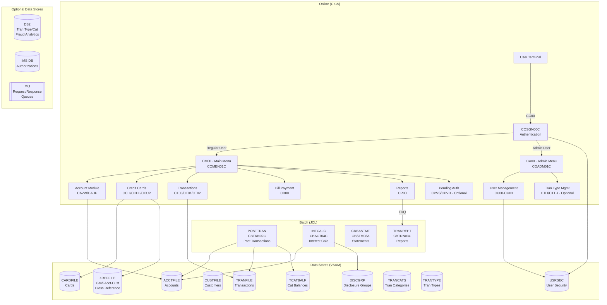

# System CardDemo - Overview for User Stories

**Version:** 2026-03-11  
**Purpose:** Single source of truth for creating well-structured User Stories

---

## 📊 Platform Statistics

- **Technology Stack:** COBOL, CICS, VSAM (KSDS with AIX), JCL, RACF, Assembler; optional DB2, IMS DB, MQ
- **Architecture Pattern:** CICS online transaction processing + JCL batch processing on IBM mainframe
- **Key Capabilities:** Credit card account management, transaction processing, bill payment, reporting, user administration
- **Application Type:** Mainframe showcase application for AWS migration and modernization scenarios
- **Total Online Transactions:** 20 (core) + 5 optional
- **Total Batch Jobs:** 25+ core jobs + optional extension jobs

---

## 🏗️ High-Level Architecture

### Technology Stack
**Primary Language:** COBOL (IBM Enterprise COBOL)  
**Transaction Monitor:** CICS (Customer Information Control System)  
**Batch:** JCL (Job Control Language)  
**Storage:** VSAM KSDS with AIX (primary), optional DB2 and IMS DB  
**Security:** RACF (Resource Access Control Facility)  
**System Programming:** IBM Assembler (MVSWAIT timer, COBDATFT date utility)  
**Optional:** DB2 (relational), IMS DB (hierarchical), MQ (message queuing)

### Architectural Patterns
- **Pseudo-Conversational CICS:** Each transaction completes, saves state in COMMAREA, and re-invokes for next screen interaction
- **VSAM KSDS with AIX:** Primary data store; indexed sequential access with alternate index for cross-referencing
- **Batch Transaction Processing:** Daily transaction files posted via batch (POSTTRAN/CBTRN02C) with interest calculation (INTCALC/CBACT04C)
- **Extra-Partition TDQ:** Report generation initiated online (CORPT00C) submits batch JCL through an extra-partition Transient Data Queue
- **Copybook-Based Data Models:** All record layouts defined in copybooks (`.cpy`) shared between programs and batch jobs
- **Two-User Roles:** Regular users (card management) and Admin users (user management + optional transaction type management)

---

## 📚 Module Catalog

<!-- MODULE_LIST_START -->
**Modules:** authentication, accounts, credit-cards, transactions, bill-payment, reports, user-management, batch-processing, authorization, transaction-type-db2, account-extraction-mq
<!-- MODULE_LIST_END -->

---

### 1. Authentication
**ID:** `authentication`  
**Purpose:** User signon, credential validation, role-based menu routing  
**Key Components:** `COSGN00C` (CICS program), `COSGN00` (BMS map), `CSUSR01Y` (user record copybook), `USRSEC` VSAM file  
**Transaction:** `CC00`  
**User Story Examples:**
- As a user, I want to log in with my user ID and password so I can access the CardDemo application
- As an admin, I want invalid login attempts to be rejected so that unauthorized access is prevented

---

### 2. Accounts
**ID:** `accounts`  
**Purpose:** View and update credit card account information including balances, limits, and dates  
**Key Components:** `COACTVWC` (view, CAVW), `COACTUPC` (update, CAUP), `CVACT01Y` (account record), `COACTUP`/`COACTVW` (BMS maps)  
**Transactions:** `CAVW` (view), `CAUP` (update)  
**Data Model:** See `ACCOUNT-RECORD` (CVACT01Y) — 300-byte VSAM KSDS record, key = `ACCT-ID` (PIC 9(11))  
**User Story Examples:**
- As a user, I want to view my account details so I can see my current balance and credit limit
- As a user, I want to update my account information so I can keep my address current

---

### 3. Credit Cards
**ID:** `credit-cards`  
**Purpose:** List, view, and update credit card records linked to accounts via the CARDXREF cross-reference VSAM file. Each account can hold multiple cards; the cross-reference maps card number → customer ID + account ID enabling bi-directional navigation.  
**Key Components:**
- `COCRDLIC` (CICS program, transaction `CCLI`) — Lists cards for an account; browses XREFFILE AIX by account ID; supports pagination (PF7/PF8) and optional filtering by card number; allows selection for view (S) or update (U)
- `COCRDSLC` (CICS program, transaction `CCDL`) — Displays full detail for a single card (number, account, CVV, embossed name, expiry, status); reads CARDFILE directly by card number
- `COCRDUPC` (CICS program, transaction `CCUP`) — Updates editable card fields (embossed name, active status, expiry month/year) using a two-pass validate-then-confirm pattern (Enter to validate, PF5 to commit REWRITE)
- `CVACT02Y` — `CARD-RECORD` copybook (150 bytes, VSAM KSDS, key = `CARD-NUM` PIC X(16))
- `CVACT03Y` — `CARD-XREF-RECORD` copybook (50 bytes; `XREF-CARD-NUM` → `XREF-CUST-ID` + `XREF-ACCT-ID`)
- `CVCRD01Y` — `CC-WORK-AREAS` copybook — module COMMAREA extension (AID key, routing fields, context IDs)
- `COCRDLI`, `COCRDSL`, `COCRDUP` — BMS map sets (24×80 3270 terminal screens)

**Transactions:** `CCLI` (list), `CCDL` (view), `CCUP` (update)  
**VSAM Files:**
- `CARDDAT` — CARDFILE primary path (READ, REWRITE by card number)
- `CARDAIX` — CARDFILE alternate index path (STARTBR/READNEXT/READPREV by account ID)
- `XREFFILE` — Card cross-reference (READ by card number; maps card → customer + account)

**Data Model:** `CARD-RECORD` (CVACT02Y) — 150-byte VSAM KSDS record, key = `CARD-NUM` (PIC X(16)); `CARD-XREF-RECORD` (CVACT03Y) — 50-byte cross-reference  
**Internal Dependencies:** `authentication` (user context in COMMAREA), `accounts` (ACCT-ID context passed via COMMAREA)  
**Business Rules:**
- Regular users see only cards linked to their own account; admin users can list all cards
- `CARD-ACTIVE-STATUS` must be `'Y'` (active) or `'N'` (inactive) — controls card usability
- `CARD-EMBOSSED-NAME` accepts only alphabetic characters and spaces (max 50 chars)
- Expiry month must be 1–12; expiry year must be 1950–2099
- CVV (`CARD-CVV-CD`) is stored as plain 3-digit numeric — no encryption in base application
- Field name typo `CARD-EXPIRAION-DATE` ("expiraion" not "expiration") must be preserved for VSAM binary compatibility

**User Story Examples:**
- As a regular user, I want to list all cards on my account so I can see which are active
- As a regular user, I want to view card details so I can see the card number, expiry, and status
- As a regular user, I want to update my card active status so I can activate or deactivate a card
- As a regular user, I want to update the embossed name on my card so it reflects my current name
- As a regular user, I want to update my card expiry date to record a newly issued card

---

### 4. Transactions
**ID:** `transactions`  
**Purpose:** List, view, and add credit card transactions  
**Key Components:** `COTRN00C` (list, CT00), `COTRN01C` (view, CT01), `COTRN02C` (add, CT02), `CVTRA05Y` (transaction record), `CVTRA06Y` (daily transaction)  
**Transactions:** `CT00` (list), `CT01` (view), `CT02` (add)  
**Data Model:** See `TRAN-RECORD` (CVTRA05Y) — 350-byte VSAM KSDS record, key = `TRAN-ID` (PIC X(16))  
**User Story Examples:**
- As a user, I want to list my transactions so I can review my recent activity
- As a user, I want to view transaction details so I can verify a specific transaction
- As a user, I want to add a transaction so I can record a purchase manually

---

### 5. Bill Payment
**ID:** `bill-payment`  
**Purpose:** Process bill payments — pay the account balance in full and record the payment as a transaction  
**Key Components:** `COBIL00C` (CICS, CB00), `COBIL00` (BMS map)  
**Transaction:** `CB00`  
**Business Rule:** Full balance payment creates an offsetting transaction in the transaction file  
**User Story Examples:**
- As a user, I want to pay my bill online so I can settle my account balance

---

### 6. Reports
**ID:** `reports`  
**Purpose:** Generate and view transaction reports; produce account statements  
**Key Components:** `CORPT00C` (CICS initiation, CR00), `CBTRN03C` (batch transaction detail report), `CBSTM03A`/`CBSTM03B` (batch statement — plain text and HTML), `CORPT00` (BMS map)  
**Transaction:** `CR00`  
**Integration:** `CORPT00C` submits batch JCL via extra-partition TDQ; `CBTRN03C` reads transaction, cross-reference, transaction type, and transaction category VSAM files  
**User Story Examples:**
- As a user, I want to generate a transaction report so I can download a history of all transactions
- As a user, I want to receive a monthly account statement so I can review my billing cycle

---

### 7. User Management
**ID:** `user-management`  
**Purpose:** Admin-only CRUD operations on the USRSEC user security file  
**Key Components:** `COADM01C` (admin menu, CA00), `COUSR00C` (list, CU00), `COUSR01C` (add, CU01), `COUSR02C` (update, CU02), `COUSR03C` (delete, CU03), `CSUSR01Y` (user record)  
**Transactions:** `CA00` (admin menu), `CU00`–`CU03` (user CRUD)  
**Data Model:** `SEC-USER-DATA` (CSUSR01Y) — 80-byte VSAM record with user ID, first/last name, password, user type  
**Access Control:** Only users with `SEC-USR-TYPE = 'A'` (Admin) can access user management  
**User Story Examples:**
- As an admin, I want to list all users so I can manage system access
- As an admin, I want to add a new user so I can grant system access to a new employee
- As an admin, I want to update a user's record so I can change their role or password
- As an admin, I want to delete a user so I can revoke access when an employee leaves

---

### 8. Batch Processing
**ID:** `batch-processing`  
**Purpose:** Nightly/periodic batch jobs for transaction posting, interest calculation, data loading, and reporting  
**Key Components:**
- `CBTRN02C` (POSTTRAN) — Post daily transactions to VSAM, update account balances, reject invalid records
- `CBACT04C` (INTCALC) — Interest calculation using disclosure group rates
- `CBSTM03A`/`CBSTM03B` (CREASTMT) — Statement generation (plain text + HTML)
- `CBTRN03C` (TRANREPT) — Transaction detail report
- `CBCUS01C` (read/print customer data)
- `CBACT01C`–`CBACT03C` (account data utilities)
- `CBEXPORT`/`CBIMPORT` — Data export/import utilities
- `COBSWAIT` (WAITSTEP) — Job wait step using Assembler MVSWAIT timer
**JCL Jobs:** POSTTRAN, INTCALC, CREASTMT, TRANREPT, COMBTRAN, TRANBKP, and data-loading jobs  
**User Story Examples:**
- As a system operator, I want the daily batch to post transactions automatically so account balances stay current
- As a system operator, I want interest to be calculated nightly so charges are applied correctly

---

### 9. Authorization (Optional — IMS/DB2/MQ)
**ID:** `authorization`  
**Purpose:** Real-time credit card authorization processing via MQ with IMS DB storage and DB2 fraud analytics  
**Key Components:** `COPAUA0C` (MQ trigger processor), `COPAUS0C` (summary, CPVS), `COPAUS1C` (detail, CPVD), `COPAUS2C` (additional), `CBPAUP0C` (batch purge), IMS HIDAM database (DBPAUTP0)  
**Transactions:** `CPVS` (summary), `CPVD` (detail), `CP00` (process requests)  
**Flow:** MQ message → COPAUA0C → IMS DB insert → DB2 fraud log → response via reply queue  
**User Story Examples:**
- As a user, I want to view pending authorizations so I can track unmatched charges
- As a user, I want to mark a suspicious authorization as fraud so it can be investigated
- As a system operator, I want expired authorizations purged daily so available credit is restored

---

### 10. Transaction Type DB2 (Optional)
**ID:** `transaction-type-db2`  
**Purpose:** Admin maintenance of transaction type reference data in DB2 with VSAM integration  
**Key Components:** `COTRTLIC` (list, CTLI), `COTRTUPC` (add/edit, CTTU), `COBTUPDT` (batch maintenance)  
**Transactions:** `CTLI` (list/update/delete), `CTTU` (add/edit)  
**DB2 Tables:** `TRANTYPE` (transaction types), `TRANCAT` (transaction categories), with indexes  
**Demonstrates:** Static embedded SQL, cursor processing, DB2 CRUD in CICS environment  
**User Story Examples:**
- As an admin, I want to list all transaction types so I can manage reference data
- As an admin, I want to add a new transaction type so I can categorize new payment methods

---

### 11. Account Extraction MQ (Optional)
**ID:** `account-extraction-mq`  
**Purpose:** Asynchronous account data extraction and inquiry via MQ request/response  
**Key Components:** `CODATE01` (CDRD — system date inquiry), `COACCT01` (CDRA — account details inquiry)  
**Transactions:** `CDRD` (date via MQ), `CDRA` (account via MQ)  
**MQ Queues:** `CARDDEMO.REQUEST.QUEUE`, `CARDDEMO.RESPONSE.QUEUE`  
**Demonstrates:** MQ request/response pattern, message correlation, async CICS-MQ integration  
**User Story Examples:**
- As an external system, I want to query account details via MQ so I can integrate without direct VSAM access

---

## 🔄 Architecture Diagram



---

## 📊 Data Models

### Account Record (`CVACT01Y`) — 300 bytes, VSAM KSDS key = `ACCT-ID`
```cobol
01  ACCOUNT-RECORD.
    05  ACCT-ID                   PIC 9(11).
    05  ACCT-ACTIVE-STATUS        PIC X(01).    -- 'Y' active / 'N' inactive
    05  ACCT-CURR-BAL             PIC S9(10)V99.
    05  ACCT-CREDIT-LIMIT         PIC S9(10)V99.
    05  ACCT-CASH-CREDIT-LIMIT    PIC S9(10)V99.
    05  ACCT-OPEN-DATE            PIC X(10).    -- YYYY-MM-DD
    05  ACCT-EXPIRAION-DATE       PIC X(10).    -- YYYY-MM-DD
    05  ACCT-REISSUE-DATE         PIC X(10).    -- YYYY-MM-DD
    05  ACCT-CURR-CYC-CREDIT      PIC S9(10)V99.
    05  ACCT-CURR-CYC-DEBIT       PIC S9(10)V99.
    05  ACCT-ADDR-ZIP             PIC X(10).
    05  ACCT-GROUP-ID             PIC X(10).    -- links to DISCGRP for interest rates
    05  FILLER                    PIC X(178).
```

### Card Record (`CVACT02Y`) — 150 bytes, VSAM KSDS key = `CARD-NUM`
```cobol
01  CARD-RECORD.
    05  CARD-NUM                  PIC X(16).
    05  CARD-ACCT-ID              PIC 9(11).
    05  CARD-CVV-CD               PIC 9(03).
    05  CARD-EMBOSSED-NAME        PIC X(50).
    05  CARD-EXPIRAION-DATE       PIC X(10).
    05  CARD-ACTIVE-STATUS        PIC X(01).
    05  FILLER                    PIC X(59).
```

### Card Cross-Reference (`CVACT03Y`) — 50 bytes, VSAM KSDS key = `XREF-CARD-NUM`
```cobol
01  CARD-XREF-RECORD.
    05  XREF-CARD-NUM             PIC X(16).
    05  XREF-CUST-ID              PIC 9(09).
    05  XREF-ACCT-ID              PIC 9(11).
    05  FILLER                    PIC X(14).
```

### Customer Record (`CVCUS01Y`) — 500 bytes, VSAM KSDS key = `CUST-ID`
```cobol
01  CUSTOMER-RECORD.
    05  CUST-ID                   PIC 9(09).
    05  CUST-FIRST-NAME           PIC X(25).
    05  CUST-MIDDLE-NAME          PIC X(25).
    05  CUST-LAST-NAME            PIC X(25).
    05  CUST-ADDR-LINE-1          PIC X(50).
    05  CUST-ADDR-LINE-2          PIC X(50).
    05  CUST-ADDR-LINE-3          PIC X(50).
    05  CUST-ADDR-STATE-CD        PIC X(02).
    05  CUST-ADDR-COUNTRY-CD      PIC X(03).
    05  CUST-ADDR-ZIP             PIC X(10).
    05  CUST-PHONE-NUM-1          PIC X(15).
    05  CUST-PHONE-NUM-2          PIC X(15).
    05  CUST-SSN                  PIC 9(09).
    05  CUST-GOVT-ISSUED-ID       PIC X(20).
    05  CUST-DOB-YYYY-MM-DD       PIC X(10).
    05  CUST-EFT-ACCOUNT-ID       PIC X(10).
    05  CUST-PRI-CARD-HOLDER-IND  PIC X(01).
    05  CUST-FICO-CREDIT-SCORE    PIC 9(03).
    05  FILLER                    PIC X(168).
```

### Transaction Record (`CVTRA05Y`) — 350 bytes, VSAM KSDS key = `TRAN-ID`
```cobol
01  TRAN-RECORD.
    05  TRAN-ID                   PIC X(16).
    05  TRAN-TYPE-CD              PIC X(02).    -- references TRANTYPE file
    05  TRAN-CAT-CD               PIC 9(04).    -- references TRANCATG file
    05  TRAN-SOURCE               PIC X(10).
    05  TRAN-DESC                 PIC X(100).
    05  TRAN-AMT                  PIC S9(09)V99.
    05  TRAN-MERCHANT-ID          PIC 9(09).
    05  TRAN-MERCHANT-NAME        PIC X(50).
    05  TRAN-MERCHANT-CITY        PIC X(50).
    05  TRAN-MERCHANT-ZIP         PIC X(10).
    05  TRAN-CARD-NUM             PIC X(16).
    05  TRAN-ORIG-TS              PIC X(26).
    05  TRAN-PROC-TS              PIC X(26).
    05  FILLER                    PIC X(20).
```

### User Security Record (`CSUSR01Y`) — 80 bytes, VSAM KSDS key = `SEC-USR-ID`
```cobol
01  SEC-USER-DATA.
    05  SEC-USR-ID                PIC X(08).
    05  SEC-USR-FNAME             PIC X(20).
    05  SEC-USR-LNAME             PIC X(20).
    05  SEC-USR-PWD               PIC X(08).
    05  SEC-USR-TYPE              PIC X(01).    -- 'U' regular / 'A' admin
    05  SEC-USR-FILLER            PIC X(23).
```

### Disclosure Group Record (`CVTRA02Y`) — 50 bytes
```cobol
01  DIS-GROUP-RECORD.
    05  DIS-GROUP-KEY.
       10  DIS-ACCT-GROUP-ID     PIC X(10).
       10  DIS-TRAN-TYPE-CD      PIC X(02).
       10  DIS-TRAN-CAT-CD       PIC 9(04).
    05  DIS-INT-RATE             PIC S9(04)V99. -- interest rate
    05  FILLER                   PIC X(28).
```

---

## 📋 Business Rules by Module

### Authentication Rules
- Credentials validated against VSAM `USRSEC` file
- `SEC-USR-TYPE = 'U'` routes to user main menu (CM00)
- `SEC-USR-TYPE = 'A'` routes to admin menu (CA00)
- Default credentials: ADMIN001/PASSWORD (admin), USER0001/PASSWORD (regular user)
- Incorrect credentials display error message; no lockout mechanism in base version

### Account Rules
- Account identified by `ACCT-ID` (11-digit numeric)
- `ACCT-ACTIVE-STATUS = 'Y'` required for most operations
- `ACCT-GROUP-ID` maps to `DISCGRP` to determine applicable interest rates
- `ACCT-CURR-BAL` updated by batch POSTTRAN; not updated in real-time online

### Credit Card Rules
- Card linked to account via `CARD-ACCT-ID` and the `XREFFILE` cross-reference
- `CARD-ACTIVE-STATUS` controls card usability
- CVV stored in `CARD-CVV-CD` (3 digits)

### Transaction Rules
- `TRAN-TYPE-CD` (2-char) must match a valid entry in `TRANTYPE` VSAM file
- `TRAN-CAT-CD` (4-digit) must match a valid entry in `TRANCATG` VSAM file
- Daily transactions land in `DALYTRAN` (sequential file); batch POSTTRAN posts to `TRANSACT` VSAM KSDS
- Invalid transactions written to `DALYREJS` rejection file during posting
- `TCATBALF` (category balance file) updated by POSTTRAN for interest calculation grouping

### Interest Calculation Rules
- CBACT04C reads `TCATBALF` by category, looks up interest rate from `DISCGRP`, and posts finance charges to accounts
- Interest rate keyed by `ACCT-GROUP-ID + TRAN-TYPE-CD + TRAN-CAT-CD`

### Bill Payment Rules
- COBIL00C pays current balance in full
- Payment recorded as a new transaction entry in the transaction file
- Account balance updated to reflect payment

### Authorization Rules (Optional)
- Authorization requests received via MQ from external POS emulator
- Business rules: amount vs. available credit, account status checks
- Approved/declined response sent to reply queue
- Authorization stored in IMS HIDAM database
- Fraud flag can be set manually (COPAUS1C) → logged in DB2
- Authorizations expire after a configurable period; batch CBPAUP0C purges expired records and restores credit

---

## 🌐 CICS Transaction Catalog

| Transaction | Program    | Function                        | User Role | Optional |
|:------------|:-----------|:--------------------------------|:----------|:---------|
| CC00        | COSGN00C   | Signon Screen                   | All       |          |
| CM00        | COMEN01C   | Main Menu (User)                | Regular   |          |
| CAVW        | COACTVWC   | Account View                    | Regular   |          |
| CAUP        | COACTUPC   | Account Update                  | Regular   |          |
| CCLI        | COCRDLIC   | Credit Card List                | Regular   |          |
| CCDL        | COCRDSLC   | Credit Card View                | Regular   |          |
| CCUP        | COCRDUPC   | Credit Card Update              | Regular   |          |
| CT00        | COTRN00C   | Transaction List                | Regular   |          |
| CT01        | COTRN01C   | Transaction View                | Regular   |          |
| CT02        | COTRN02C   | Transaction Add                 | Regular   |          |
| CR00        | CORPT00C   | Transaction Reports (submit)    | Regular   |          |
| CB00        | COBIL00C   | Bill Payment                    | Regular   |          |
| CA00        | COADM01C   | Admin Menu                      | Admin     |          |
| CU00        | COUSR00C   | List Users                      | Admin     |          |
| CU01        | COUSR01C   | Add User                        | Admin     |          |
| CU02        | COUSR02C   | Update User                     | Admin     |          |
| CU03        | COUSR03C   | Delete User                     | Admin     |          |
| CPVS        | COPAUS0C   | Pending Auth Summary            | Regular   | ✓ IMS/DB2/MQ |
| CPVD        | COPAUS1C   | Pending Auth Detail             | Regular   | ✓ IMS/DB2/MQ |
| CP00        | COPAUA0C   | Process Auth Requests           | System    | ✓ IMS/DB2/MQ |
| CTLI        | COTRTLIC   | Tran Type List/Update/Delete    | Admin     | ✓ DB2    |
| CTTU        | COTRTUPC   | Tran Type Add/Edit              | Admin     | ✓ DB2    |
| CDRD        | CODATE01   | System Date via MQ              | System    | ✓ MQ     |
| CDRA        | COACCT01   | Account Details via MQ          | System    | ✓ MQ     |

---

## 📦 Batch Job Catalog

| Job       | Program    | Function                              | Seq |
|:----------|:-----------|:--------------------------------------|:----|
| CLOSEFIL  | IEFBR14    | Close VSAM files in CICS              | 1   |
| ACCTFILE  | IDCAMS     | Reload Account VSAM                   | 2   |
| CARDFILE  | IDCAMS     | Reload Card VSAM                      | 3   |
| CUSTFILE  | IDCAMS     | Reload Customer VSAM                  | 4   |
| XREFFILE  | IDCAMS     | Reload Cross-reference VSAM           | 5   |
| TRANBKP   | IDCAMS     | Backup/restore Transaction file       | 6   |
| TRANCATG  | IDCAMS     | Reload Transaction Category file      | 7   |
| TRANTYPE  | IDCAMS     | Reload Transaction Type file          | 8   |
| DISCGRP   | IDCAMS     | Reload Disclosure Group file          | 9   |
| TCATBALF  | IDCAMS     | Reload Category Balance file          | 10  |
| DUSRSECJ  | IEBGENER   | Initial load User Security file       | 11  |
| POSTTRAN  | CBTRN02C   | Post daily transactions               | 12  |
| INTCALC   | CBACT04C   | Calculate and post interest           | 13  |
| COMBTRAN  | SORT       | Combine transaction files             | 14  |
| CREASTMT  | CBSTM03A   | Generate account statements           | 15  |
| TRANREPT  | CBTRN03C   | Transaction detail report (from CICS) | 16  |
| TRANIDX   | IDCAMS     | Define AIX on transaction file        | 17  |
| OPENFIL   | IEFBR14    | Open VSAM files in CICS               | 18  |
| WAITSTEP  | COBSWAIT   | Wait step (timer control)             | 19  |
| DEFGDGB   | IDCAMS     | Define GDG Base                       | 20  |
| CBPAUP0J  | CBPAUP0C   | Purge expired authorizations          | Opt |
| MNTTRDB2  | COBTUPDT   | Maintain DB2 transaction types        | Opt |

---

## 🎯 Patterns for User Stories

### CICS Pseudo-Conversational Pattern
Every online CICS program follows this pattern:
1. Check `EIBCALEN` (commarea length) — if 0, first invocation, display initial screen
2. Process input from previous screen interaction
3. Validate input, access VSAM files
4. Send output map (BMS) and return with COMMAREA to preserve state

### Templates by Domain

#### Account Management Stories
- As a **regular user**, I want to view my account balance so that I know how much credit I have available
- As a **regular user**, I want to update my account ZIP code so that billing information stays accurate

#### Transaction Stories
- As a **regular user**, I want to see a paginated list of my transactions so that I can review my spending
- As a **regular user**, I want to add a new transaction so that I can record a purchase immediately
- As a **regular user**, I want to generate a transaction report for a date range so that I can download my history

#### Admin Stories
- As an **admin**, I want to search for a user by ID so that I can quickly locate their record
- As an **admin**, I want to add a new user with admin privileges so that I can delegate management tasks

### Story Complexity Guidelines
- **Simple (1-2 pts):** Display-only screens, read from single VSAM file (CAVW account view)
- **Medium (3-5 pts):** CRUD with validation, cross-file lookups, COMMAREA state management (CAUP, CT02, user management)
- **Complex (5-8 pts):** Multi-file operations, batch initiation via TDQ, interest calculation (POSTTRAN, INTCALC, report generation)
- **Very Complex (8-13 pts):** Optional integrations — MQ request/response, IMS+DB2 two-phase transactions

### Acceptance Criteria Patterns
- **Authentication:** Must validate user ID and password against USRSEC file; invalid credentials display error; valid admin routes to CA00; valid user routes to CM00
- **VSAM Read:** Must handle NOTFND (record not found) response code; must display appropriate message to user
- **Data Validation:** Numeric fields must be numeric; date fields in YYYY-MM-DD format; required fields not blank
- **Batch Completion:** Job must write completion message to SYSOUT; rejection records written to DALYREJS
- **Navigation:** PF3/PF12 must return to previous menu; PF keys defined per BMS map

---

## ⚡ Performance Budgets

- **CICS Response Time:** < 2s per screen interaction (P95)
- **Batch POSTTRAN:** Process all daily transactions within maintenance window (typically < 4 hours for sample dataset)
- **VSAM Random Access:** < 10ms per keyed read (P95)
- **Interest Calculation:** Sequential read of TCATBALF + random DISCGRP and ACCOUNT lookups within batch window
- **Report Generation:** TRANREPT output within batch window; HTML statement generation proportional to transaction volume

---

## 🚨 Readiness Considerations

### Technical Risks
- **No real-time balance update:** Account balance updated only by batch POSTTRAN, not during online transaction add — online view may show stale balance
- **Password plain-text storage:** User passwords stored in VSAM without hashing — security concern for modernization
- **Single-user session:** No concurrent session management; COMMAREA is per-task
- **RACF dependency:** Security relies on RACF; must be configured before application can run

### Tech Debt
- **Typo in copybooks:** `ACCT-EXPIRAION-DATE` and `CARD-EXPIRAION-DATE` — "expiration" misspelled; must be preserved for compatibility
- **Various coding styles:** Application intentionally uses mixed COBOL styles and patterns to exercise modernization tooling
- **Filler fields:** Large FILLER areas in records provide expansion room but conceal true record utilization

### Sequencing for US
- **Prerequisites:** VSAM files initialized (DUSRSECJ, ACCTFILE, CARDFILE, CUSTFILE, XREFFILE, TRANFILE) before any online testing
- **Recommended order:** Authentication → Account View → Account Update → Credit Cards → Transactions → Bill Payment → Reports → User Management → Optional modules

---

## 📈 Success Metrics

### Application Health
- **Batch success rate:** POSTTRAN and INTCALC jobs complete RC=0 each cycle
- **Rejection rate:** DALYREJS records < 1% of daily transaction volume
- **VSAM availability:** All files OPEN in CICS at start of business

### Business Impact
- **Transaction posting accuracy:** 100% of valid daily transactions posted to TRANSACT VSAM KSDS
- **Interest calculation accuracy:** Finance charges match disclosure group rates for all account groups
- **Statement generation:** All accounts with activity receive statement output each cycle

---

*Last updated: 2026-03-11*
